# LARIS tutorial: spatial ligand–receptor analysis (Slide-tags human tonsil)

The core LARIS pipeline on the Slide-tags human tonsil dataset: compute
spatially diffused ligand–receptor scores, identify spatially specific
interactions per sender–receiver cell-type pair, and visualize them.
All outputs shown were produced by exactly this code with LARIS v0.13.0
defaults.

**Data**: the annotated tonsil object (`adata_tonsil.h5ad`, 5,695 cells ×
25,583 genes, with `obsm['X_spatial']` and `obs['cell_type']`) is
available from Zenodo record
[10.5281/zenodo.19981287](https://doi.org/10.5281/zenodo.19981287).

LARIS lives in the [PIASO](https://github.com/genecell/PIASO) ecosystem.
PIASO is **not** required — every step below runs with LARIS alone — but
if it is installed, its figure style gives the plots a consistent look:

```python
import scanpy as sc
import laris as la

try:                                   # optional: PIASO figure styling
    import piaso
    piaso.settings.set_figure_params()
except ImportError:
    sc.set_figure_params(dpi=96, dpi_save=150, frameon=False)
```

## 1. Load the data and the LR database

```python
adata = sc.read_h5ad("data/adata_tonsil.h5ad")
lr_df = la.datasets.lrDatabase(species="human")
```

```text
5,695 cells x 25,583 genes; 2,951 database LR pairs
```

The tonsil object carries cell-type and region annotations; both are
used below.

```python
sc.pl.embedding(adata, basis="X_umap", color="cell_type", frameon=False)
sc.pl.embedding(adata, basis="X_umap", color="region_name", frameon=False)
```

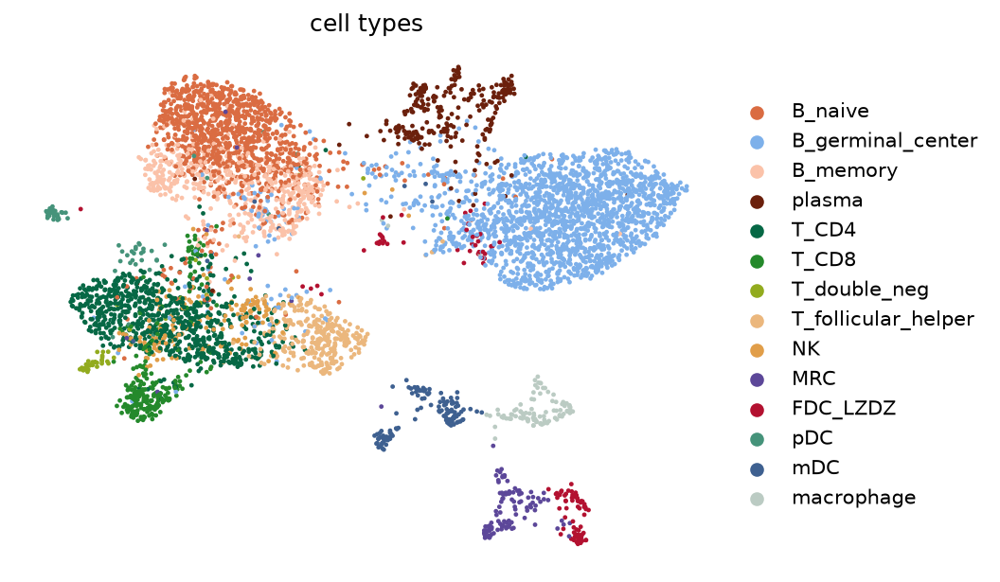
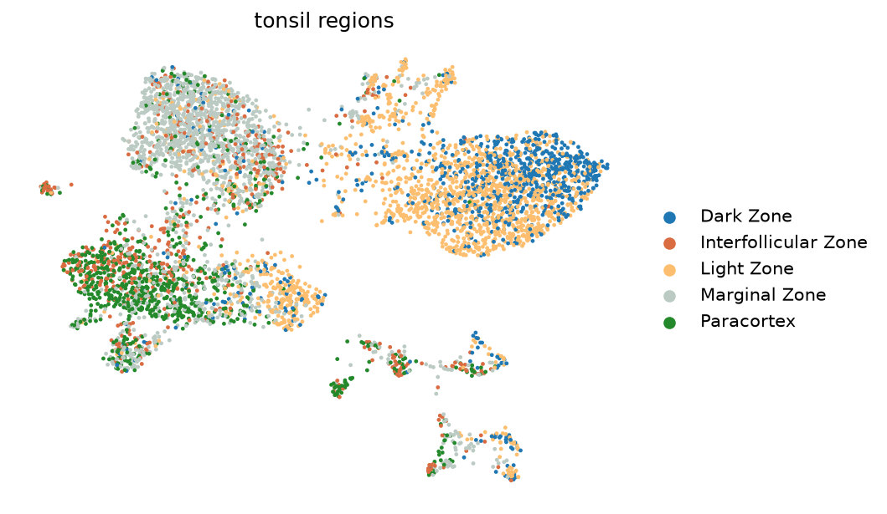

The database is a table of ligand-receptor pairs with pathway
annotation; LARIS only needs `ligand` and `receptor`, and the rest is
carried through for your own filtering.

```python
lr_df[["interaction_name", "ligand", "receptor", "pathway_name"]].head()
```

```text
      interaction_name ligand receptor pathway_name
0  TGFB1_TGFBR1_TGFBR2  TGFB1   TGFBR2         TGFb
1  TGFB1_TGFBR1_TGFBR2  TGFB1   TGFBR1         TGFb
2  TGFB2_TGFBR1_TGFBR2  TGFB2   TGFBR2         TGFb
3  TGFB2_TGFBR1_TGFBR2  TGFB2   TGFBR1         TGFb
4  TGFB3_TGFBR1_TGFBR2  TGFB3   TGFBR2         TGFb
```

```text
2,951 database pairs; 1,985 have both genes measured here
```

## 2. Spatially diffused LR scores

`prepareLRInteraction` diffuses ligand and receptor expression over the
spatial k-NN graph (adaptive kernel bandwidth by default, so coordinate
units do not matter) and multiplies the diffused pair. Only the
ligand/receptor genes are ever diffused, so this is fast and light.

```python
lr_data = la.tl.prepareLRInteraction(adata, lr_df,
                                     use_rep_spatial="X_spatial")
```

```text
lr_data: 5,695 cells x 1,985 LR pairs
```

Unmatched database pairs (genes absent from `var_names`) are dropped
with a warning; pass `unmatched='error'` when using a custom database,
where a missing name is more likely a typo.

## 3. Run LARIS

With v0.13.0 defaults (`mu=0.25`, adaptive `sigma`, all three
neighbourhood sizes at 20, `spatial_weight=3.0`), a plain call reproduces
the published tonsil reference values. The spatial specificity is
computed in closed form, so this is deterministic - no seed affects it:

```python
laris_lr, res = la.tl.runLARIS(
    lr_data, adata,
    use_rep="X_spatial", use_rep_spatial="X_spatial",
    groupby="cell_type")
```

```text
Input data: 5695 cells × 1985 LR pairs
  ✓ Identified 1985 top spatially-specific LR pairs
  - Scaling factor: 0.249302 (based on top 100 scores)
Final results: 389,060 sender-receiver-LR combinations
  - Significant interactions (FDR < 0.05): 1,345
```

```python
res.nlargest(5, "interaction_score")[
    ["sender", "receiver", "interaction_name",
     "interaction_score", "p_value_fdr"]]
```

```text
      sender receiver interaction_name  interaction_score
     B_naive  B_naive       FCER2::CR2             0.5651
T_double_neg       NK    CLEC2D::KLRB1             0.4296
         pDC  B_naive        APP::CD74             0.3659
      plasma   plasma     PECAM1::CD38             0.3329
    B_memory B_memory     COL4A3::CD44             0.3202
```

The full results table is one row per sender-receiver-LR combination:

```python
res.head(10)
```

```text
           sender          receiver  interaction_score ligand receptor interaction_name  p_value  p_value_fdr
          B_naive           B_naive           0.5625  FCER2      CR2       FCER2::CR2   0.0018       0.0380
     T_double_neg                NK           0.4287 CLEC2D    KLRB1    CLEC2D::KLRB1   0.0007       0.0196
              pDC           B_naive           0.3656    APP     CD74        APP::CD74   0.0004       0.0088
           plasma            plasma           0.3323 PECAM1     CD38     PECAM1::CD38   0.0207       0.0790
         B_memory          B_memory           0.3201 COL4A3     CD44     COL4A3::CD44   0.0001       0.0026
         B_memory             T_CD8           0.2941 COL4A3     CD44     COL4A3::CD44   0.0001       0.0021
              pDC          B_memory           0.2545    APP     CD74        APP::CD74   0.0022       0.0286
B_germinal_center B_germinal_center           0.2422 SEMA4A   PLXNB2   SEMA4A::PLXNB2   0.0303       0.3718
```

Score and significance are related but not the same thing, and the table
shows it: the top-scoring interaction (`FCER2::CR2`) sits at FDR 0.038,
while the fifth (`COL4A3::CD44`) reaches 0.0026. A high score says the
interaction is strong here; the p-value says it is stronger than
expression-matched chance. Sort by whichever question you are asking.

> **P-values.** The call above ranks interactions; to test them, build a
> matched-gene background once and pass it in:
> `bg = la.tl.prepareLRBackground(adata, lr_df, use_rep_spatial="X_spatial")`
> then `runLARIS(..., background=bg)`.
> [Tutorial 07](07_significance_and_background.md) covers what the
> p-value tests and how to read it.

Textbook tonsil biology: FCER2 (CD23)→CR2 (CD21) among naive B cells,
CLEC2D→KLRB1 T–NK signalling, APP→CD74.

## 4. Visualize

### Interaction scores on the tissue

```python
la.pl.plotCCCSpatial(lr_data, "X_spatial", "CCL19::CCR7",
                     color_by="score")
```


CCL19::CCR7 lights up the T-zone niches. When the object carries a
tissue image (the scanpy `uns['spatial']` convention, or a cytome image
store), it is drawn underneath automatically; `img=` and `scale_factor=`
accept an explicit registered image (e.g. Stereo-seq ssDNA).

### Dot plot across sender–receiver pairs

```python
sub = res[res.interaction_score > 0].nlargest(60, "interaction_score")
senders = sub.sender.value_counts().head(4).index.tolist()
receivers = sub.receiver.value_counts().head(4).index.tolist()
interactions = sub.interaction_name.drop_duplicates().head(10).tolist()

la.pl.plotCCCDotPlot(res, senders=senders, receivers=receivers,
                     interactions_to_plot=interactions)
```


### Expressing cells by cell type, on the tissue

The same function's default mode highlights the cells expressing an
interaction, coloured by cell type:

```python
la.pl.plotCCCSpatial(lr_data, "X_spatial", "CCL19::CCR7",
                     cell_type="cell_type", highlight_all_expressing=True)
```


### Heatmap of the top interactions

```python
la.pl.plotCCCHeatmap(res, n_top=200)
```


### Faceted dot plot

One panel per sender-receiver pair, each with its own top interactions:

```python
la.pl.plotCCCDotPlotFacet(res, senders=["B_memory", "B_naive", "plasma"],
                          receivers=["B_naive", "B_germinal_center", "T_CD8"],
                          n_top=8)
```


### Ligand, receptor and interaction in one dot plot

`prepareDotPlotAdata` concatenates the LR scores with the expression
object so ligand expression, receptor expression and the interaction
score appear side by side per cell type:

```python
adata_dot = la.pl.prepareDotPlotAdata(lr_data, adata)
la.pl.plotLRDotPlot(adata_dot,
                    interactions_to_plot=interactions[:6],
                    groupby="cell_type")
```


### Signalling network around one cell type

`plotCCCNetwork` draws one cell type's neighbourhood, in the direction
you ask for. Filtering on the FDR keeps the picture to interactions that
survived testing:

```python
la.pl.plotCCCNetwork(
    res, "B_memory", data=adata, groupby="cell_type",
    interaction_direction="sending",
    edge_width_scale=8,
    filter_significant=True, p_value_col="p_value_fdr", threshold=0.05,
    filter_by_interaction_score=True, threshold_interaction_score=0.001,
    figsize=(9, 8))
```

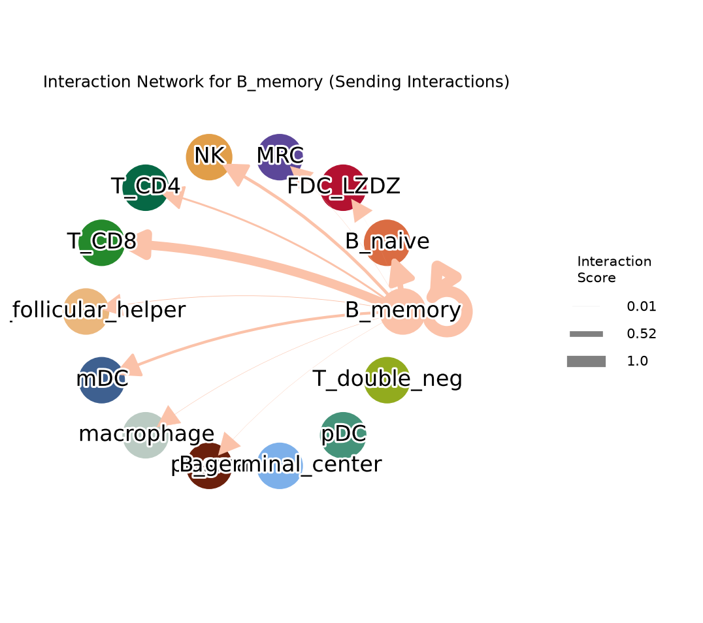

```python
la.pl.plotCCCNetwork(
    res, "B_memory", data=adata, groupby="cell_type",
    interaction_direction="receiving",          # the other direction
    edge_width_scale=8,
    filter_significant=True, p_value_col="p_value_fdr", threshold=0.05,
    filter_by_interaction_score=True, threshold_interaction_score=0.001,
    figsize=(9, 8))
```

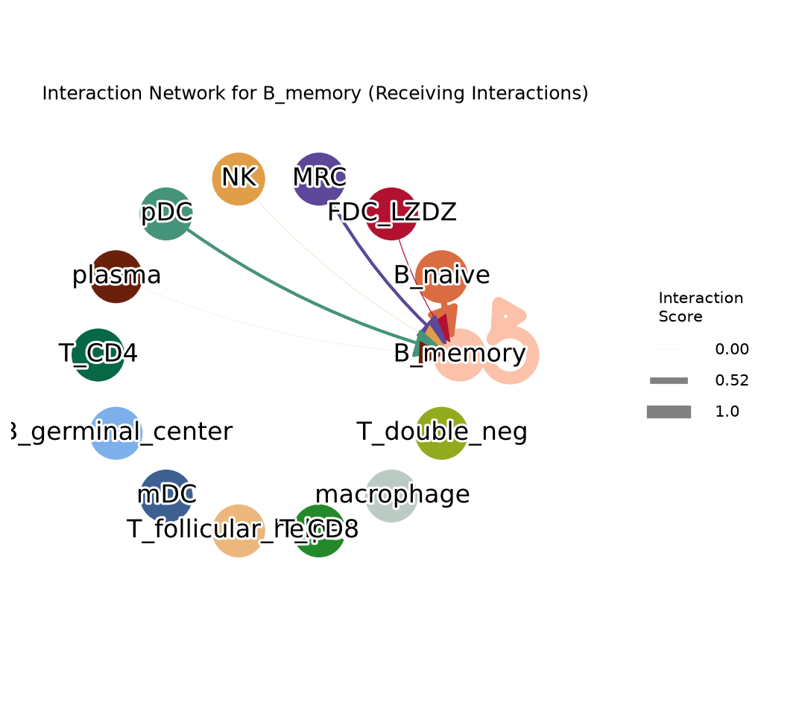

**`edge_width_scale` almost always needs tuning.** Edge width is the
summed interaction score times this factor, and the sum depends on how
many interactions a cell-type pair has and how strong they are - so a
value that suits one dataset will be too thick or too thin on the next.
Here B_memory's heaviest edge sums to about 1.0, so the default of 30
draws it as a 30-point band:

```python
la.pl.plotCCCNetwork(res, "B_memory", data=adata, groupby="cell_type",
                     interaction_direction="sending")   # default width
```

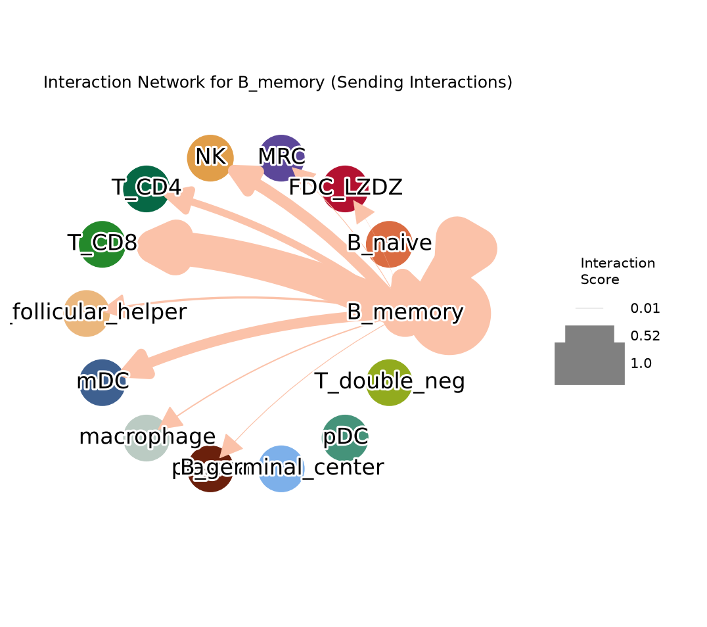

Divide the scale until the widest edge is legible - 8 here. A quick way
to choose: `res.groupby(["sender", "receiver"]).interaction_score.sum().max()`
gives the heaviest edge, and `edge_width_scale ~ 8 / that` puts it at
roughly 8 points.

Which cell type to pick matters too. `B_germinal_center` has only four
significant sending edges on this dataset, so its network is nearly
empty; `B_memory` has eleven. If a network looks sparse, check how many
rows survive the filters before adjusting the drawing.

### Cumulative network across all cell types

```python
la.pl.plotCCCNetworkCumulative(res, data=adata, groupby="cell_type")
```


The loops are **self-interactions** - a cell type signalling to itself,
which on this dataset is a subset of the calls at FDR < 0.05 and includes the
single strongest interaction overall (`B_naive -> B_naive`,
FCER2::CR2). Autocrine and within-cell-type signalling is common, so
these are drawn like any other edge, with the same colour-by-sender and
width-by-score. Pass `include_self_interactions=False` to either network
function for a plot restricted to interactions between different cell
types.

## 5. The LR-score object is ordinary AnnData

`lr_data` has cells as rows and LR pairs as columns, so every scanpy
tool works on it directly. Copy across whatever annotations you want to
group by:

```python
lr_data.obs[["cell_type", "region_name"]] = adata.obs[["cell_type", "region_name"]].values
lr_data.obsm["X_spatial"] = adata.obsm["X_spatial"]
lr_data.obsm["X_umap"] = adata.obsm["X_umap"]

top = laris_lr.sort_values("score", ascending=False).index[:10]
sc.pl.dotplot(lr_data, top, groupby="cell_type",
              standard_scale="var", cmap="Spectral_r")
```

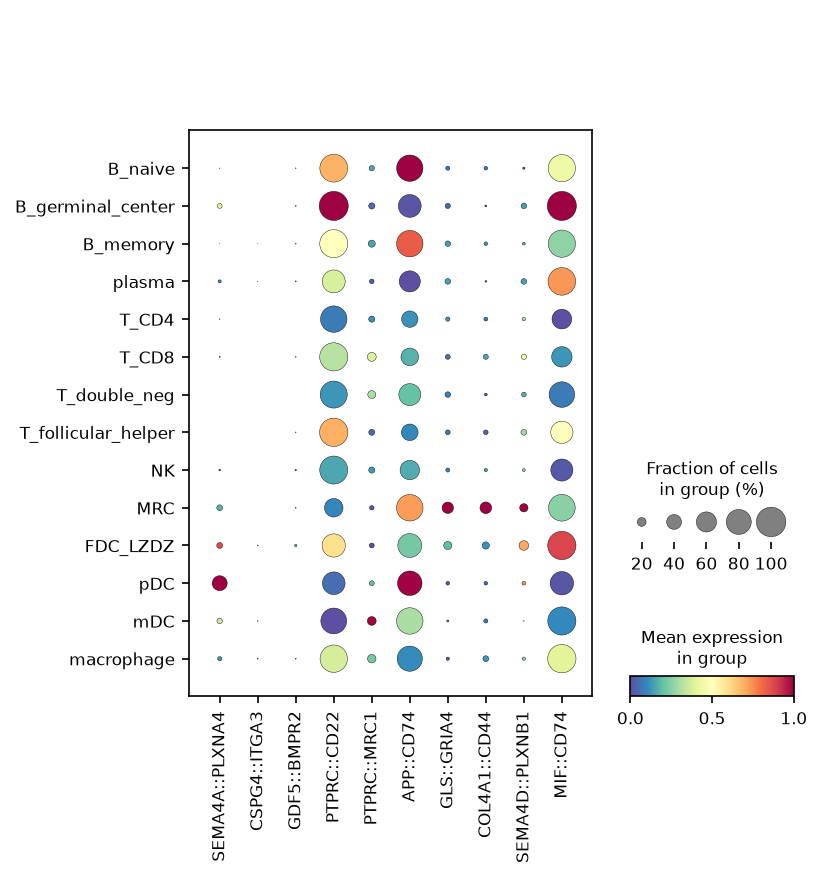

```python
sc.pl.dotplot(lr_data, top, groupby="region_name",
              standard_scale="var", cmap="Spectral_r")
```

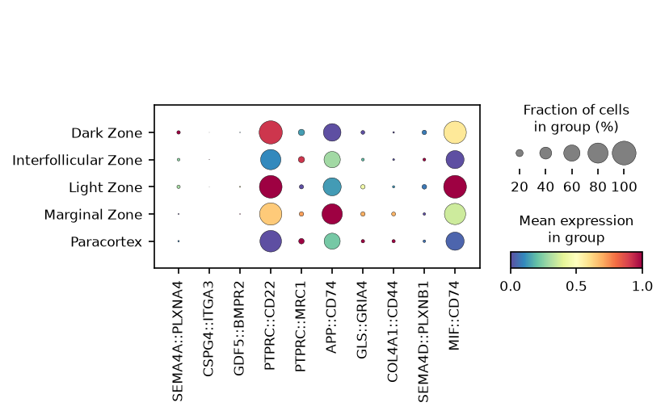

The same scores on the tissue and on the UMAP, several pairs at once:

```python
sc.pl.embedding(lr_data, basis="X_spatial", color=top[:4],
                cmap="magma_r", ncols=4, frameon=False)
```

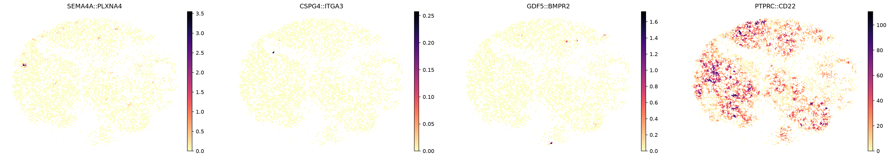

```python
sc.pl.embedding(lr_data, basis="X_umap",
                color=res["interaction_name"].unique()[:9],
                cmap="magma_r", ncols=3, frameon=False)
```

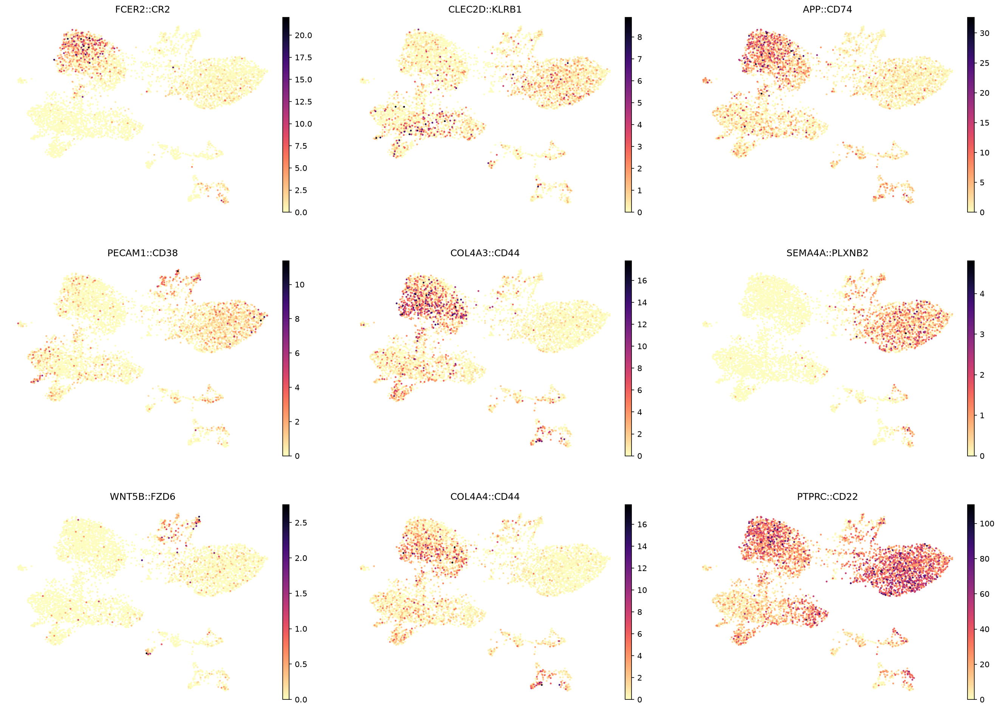

### Which interactions mark which region

Because `lr_data` is AnnData, COSG can find marker *interactions* for a
grouping exactly as it finds marker genes:

```python
import cosg
cosg.cosg(lr_data, key_added="cosg", mu=100, expressed_pct=0.15,
          remove_lowly_expressed=True, n_genes_user=100,
          groupby="region_name")

sc.pp.pca(lr_data, n_comps=30)
sc.tl.dendrogram(lr_data, groupby="region_name", use_rep="X_pca")
df = pd.DataFrame(lr_data.uns["cosg"]["names"][:6, ]).T
df = df.reindex(lr_data.uns["dendrogram_region_name"]["categories_ordered"])
markers = {idx: list(row.values) for idx, row in df.iterrows()}

sc.pl.dotplot(lr_data, markers, groupby="region_name", dendrogram=True,
              standard_scale="var", cmap="Spectral_r")
```

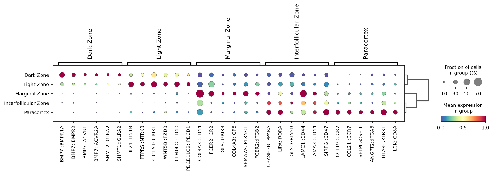

The result reads as tonsil anatomy without being told any of it: the
**Light Zone** is marked by `IL21::IL21R`, the follicular-helper-to-B
signal that defines it; the **Dark Zone** by BMP7 receptor axes; the
**Marginal Zone** by `FCER2::CR2` and `COL4A3::CD44`.

## 6. Filtering the summary views

Both summary plots take the same filter arguments, so the same result
table can be shown loosely or strictly. Unfiltered, ranked by score:

```python
la.pl.plotCCCHeatmap(res, cmap="plasma", filter_significant=False,
                     n_top=2000)
```

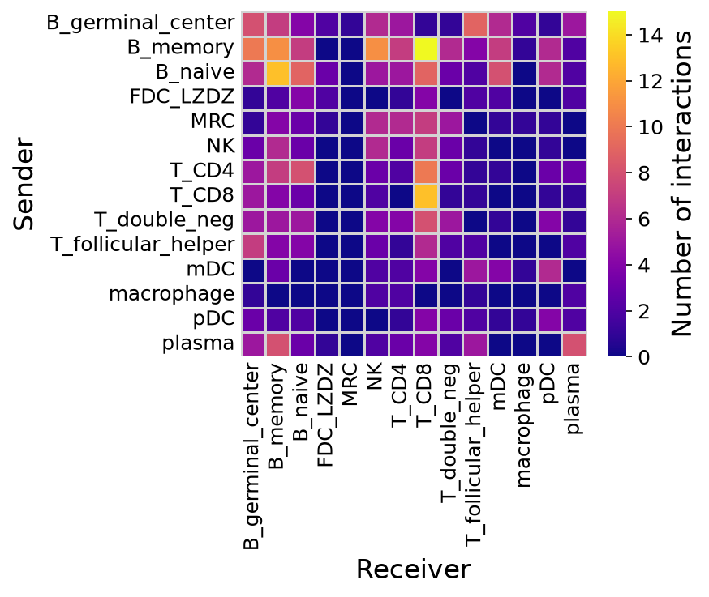

Filtered on FDR and score:

```python
la.pl.plotCCCHeatmap(
    res, cmap="Purples", figsize=(6, 5),
    axis_label_fontsize=16, tick_fontsize=12,
    cbar_label_fontsize=16, cbar_tick_fontsize=12,
    filter_significant=True, p_value_col="p_value_fdr", threshold=0.05,
    filter_by_interaction_score=True, threshold_interaction_score=0.01,
    show_borders=False, cluster=True)
```

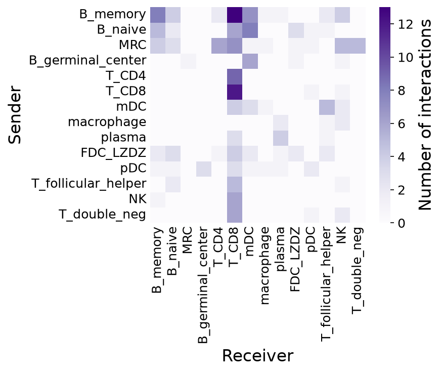

Relaxing the threshold to 0.10 admits more cell-type pairs:

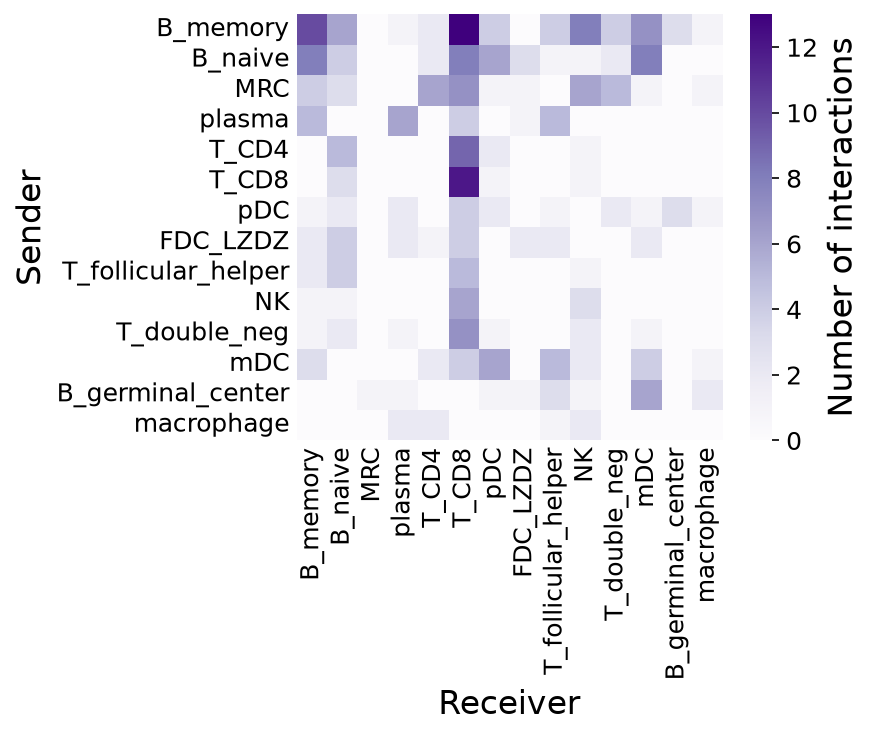

### A curated set of interactions

When you already know which interactions to show, pass them explicitly.
`interactions_to_plot`, `senders` and `receivers` are matched
**positionally**, so the three lists must be the same length:

```python
la.pl.plotCCCDotPlot(
    res,
    interactions_to_plot=["CCL21::CCR7", "CD40LG::CD40", "PDCD1LG2::PDCD1",
                          "PTPRC::CD22", "LAMA4::CD44", "COL1A1::CD44"],
    senders=["MRC", "MRC", "macrophage", "MRC",
             "T_follicular_helper", "B_germinal_center"],
    receivers=["T_CD4", "T_follicular_helper", "T_follicular_helper",
               "B_memory", "B_germinal_center", "T_follicular_helper"],
    bubble_size=500, cmap="YlGn",
    filter_significant=True, p_value_col="p_value_fdr", threshold=0.05,
    filter_by_interaction_score=True, threshold_interaction_score=0.01,
    figsize=(8, 6), show_grid=False)
```

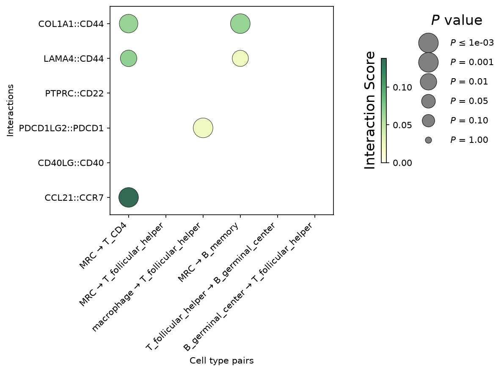

`show_grid=True` adds guide lines, which helps when the panel is wide:

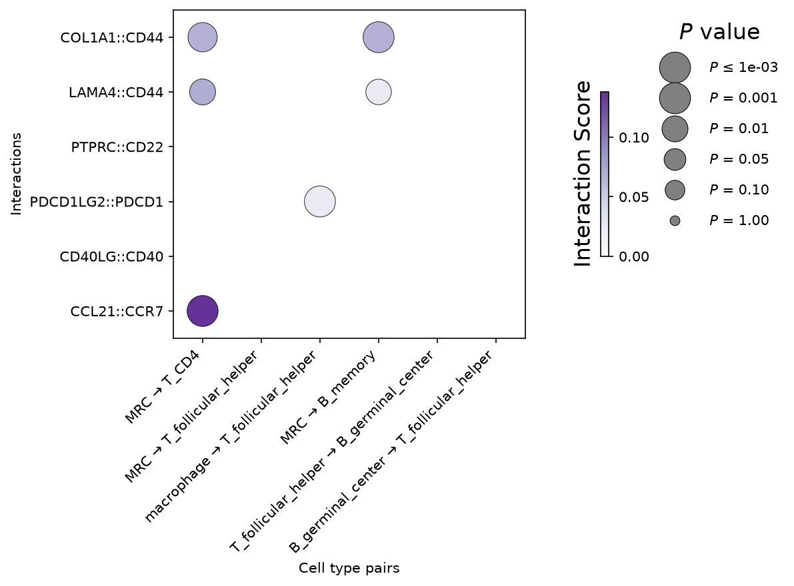

## Notes

- **Multi-section objects**: when several sections are tiled into one
  coordinate system, pass `section_key='<obs column>'` to both
  `prepareLRInteraction` and `runLARIS` — every spatial neighbour graph
  (including the randomised background) is then built within sections,
  so no neighbourhood crosses a tile boundary.
- **Targeted panels** (Xenium, MERFISH): few database genes are present,
  so the cell-type specificity spread over LR genes alone is unstable —
  use `runLARIS(..., specificity_reference='all')`. A warning fires
  automatically below 100 matched genes.
- **Reproducing v0.9.x**: pass `number_nearest_neighbors=10` to
  `prepareLRInteraction` and `mu=1, sigma=100, n_nearest_neighbors=10,
  number_nearest_neighbors=10, spatial_weight=1.0` to `runLARIS`.
- **Tissue image overlay** (H&E / ssDNA): see the
  [overlay tutorial](05_tissue_image_overlay.md).
- **Large data / on-disk workflows**: see the
  [cytome guide](04_cytome_guide.md).
- **Comparing conditions**: see the
  [aggregate](02_comparelaris_visium_mi.md) and
  [matched](03_comparelaris_matched_merfish_gut.md) comparison
  tutorials.
