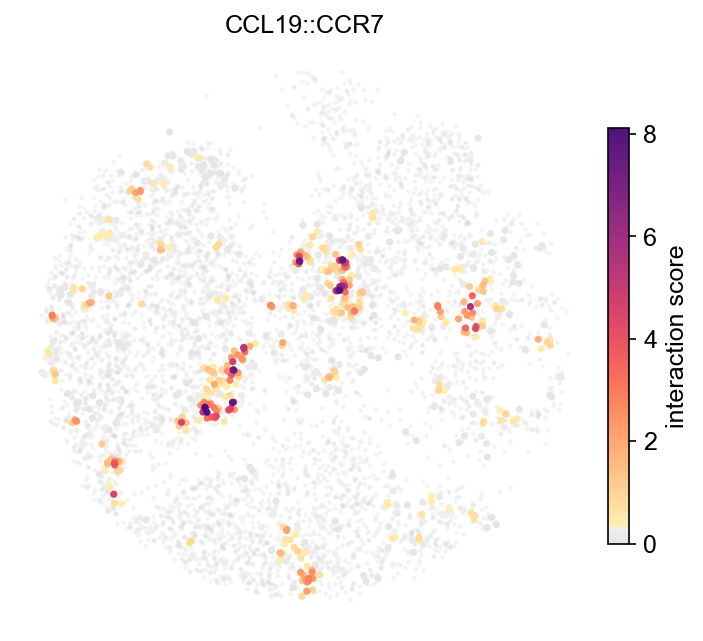
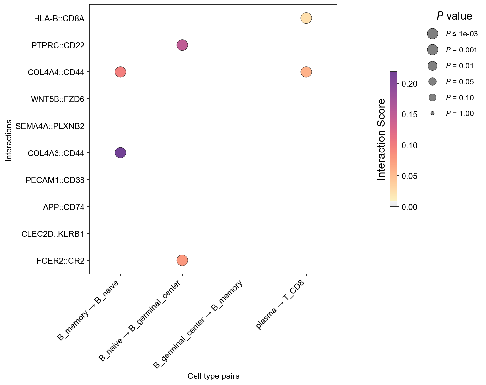
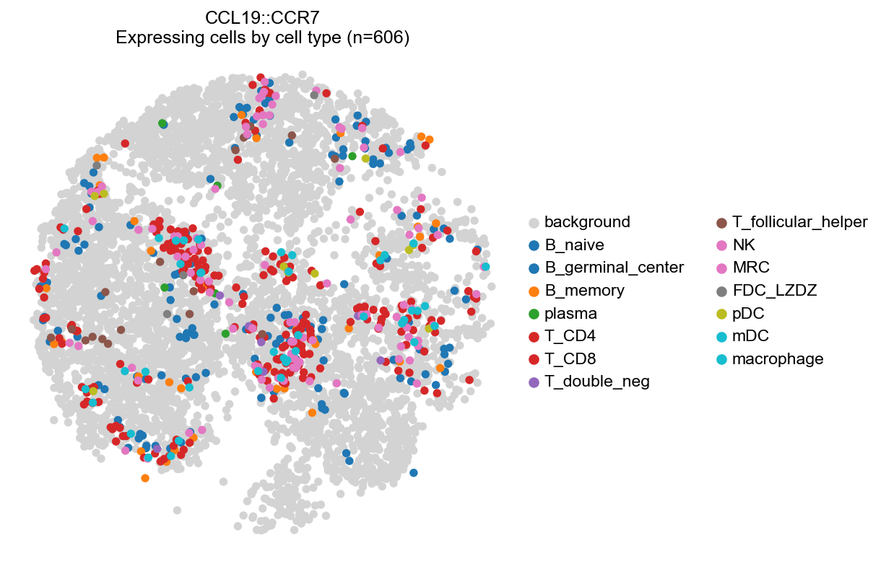
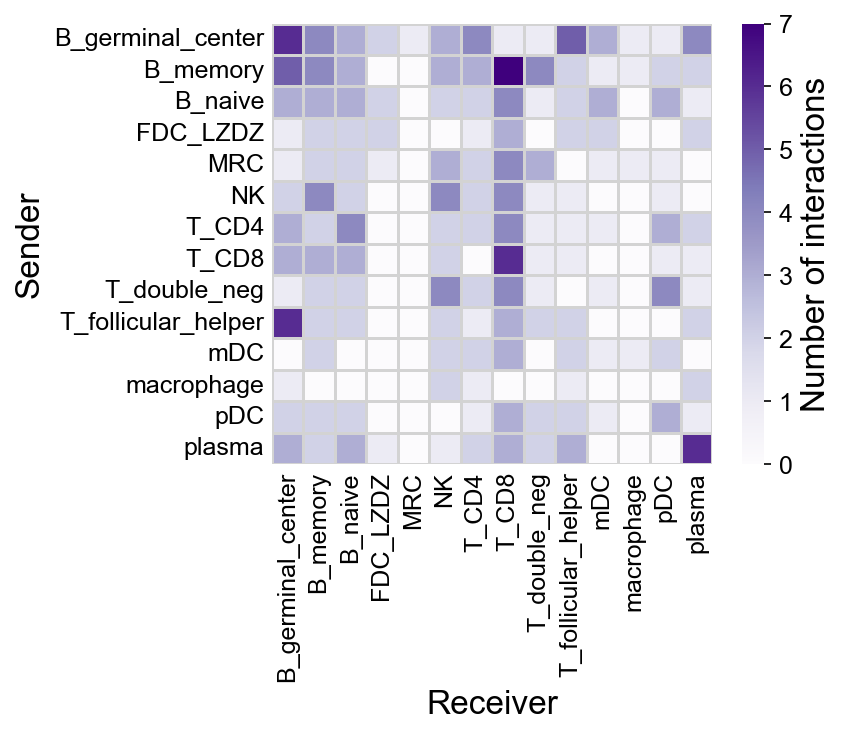
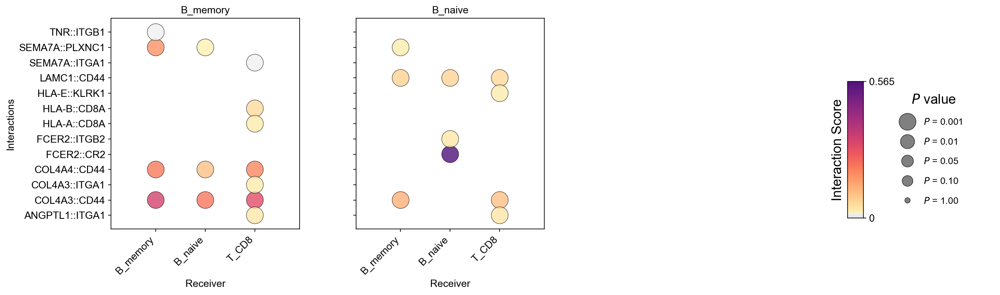
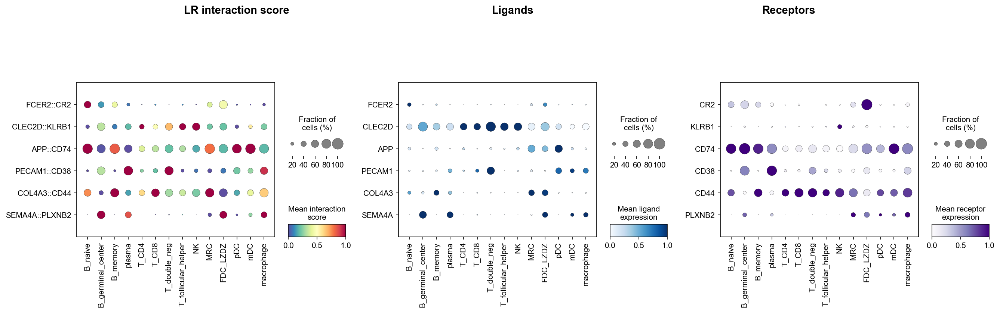
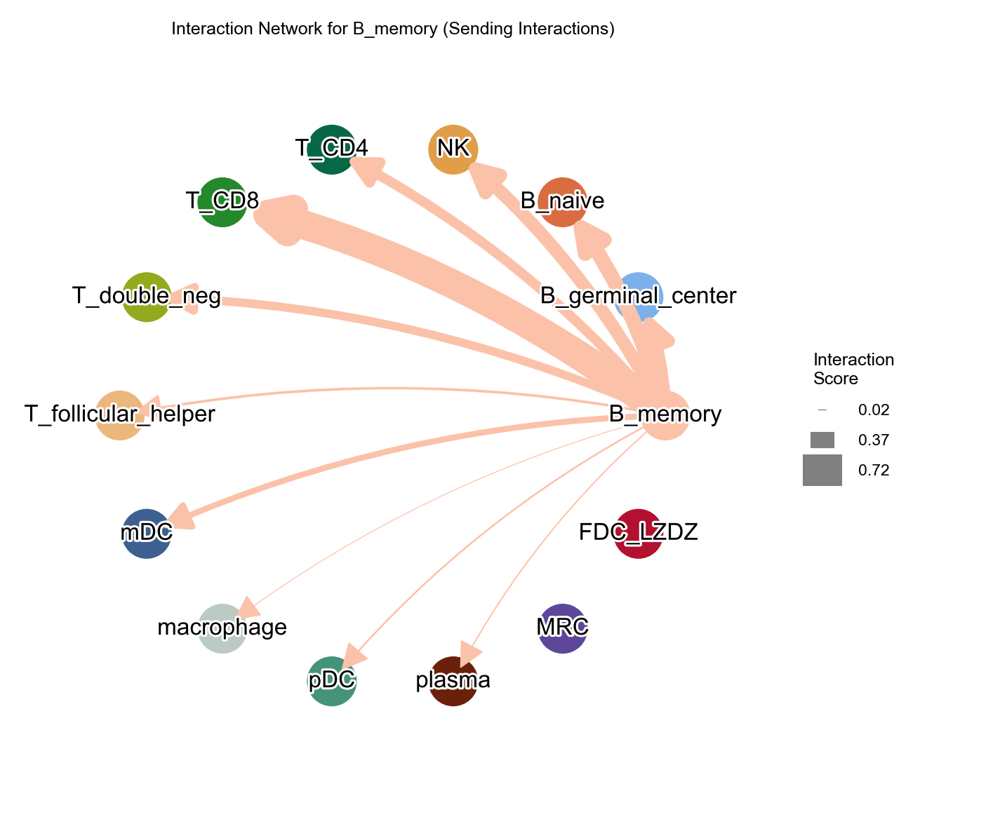
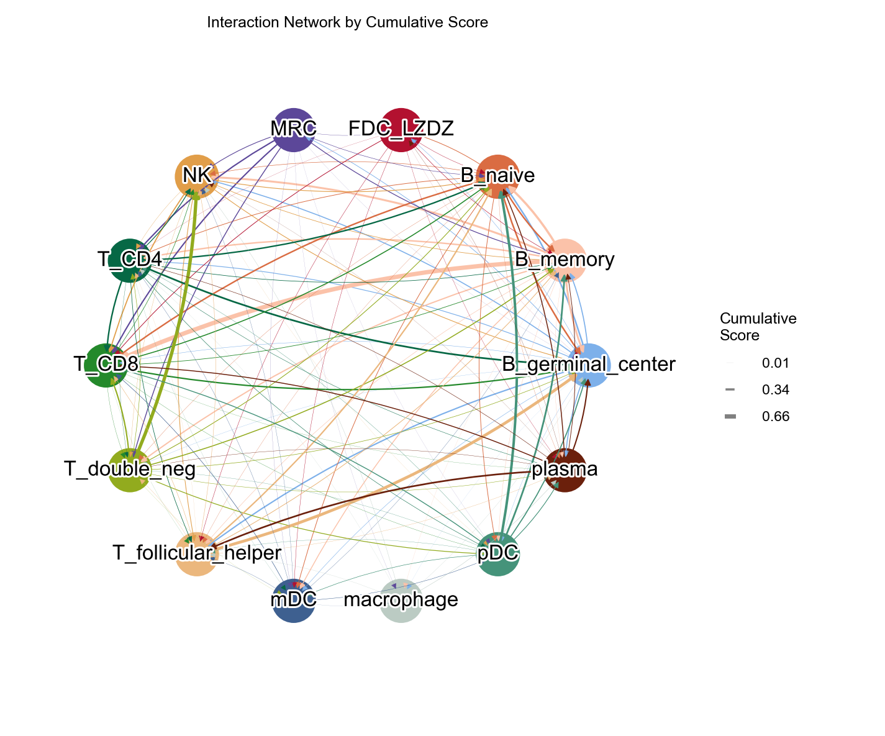

# LARIS tutorial: spatial ligand–receptor analysis (Slide-tags human tonsil)

The core LARIS pipeline on the Slide-tags human tonsil dataset: compute
spatially diffused ligand–receptor scores, identify spatially specific
interactions per sender–receiver cell-type pair, and visualize them.
All outputs shown were produced by exactly this code with LARIS v0.11.0
defaults.

**Data**: the annotated tonsil object (`adata_tonsil.h5ad`, 5,695 cells ×
25,583 genes, with `obsm['X_spatial']` and `obs['cell_type']`) is
available from Zenodo record
[10.5281/zenodo.19981287](https://doi.org/10.5281/zenodo.19981287).

LARIS lives in the [PIASO](https://github.com/genecell/PIASO) ecosystem.
PIASO is **not** required — every step below runs with LARIS alone — but
if it is installed, its figure style gives the plots a consistent look:

```python
import scanpy as sc
import laris as la

try:                                   # optional: PIASO figure styling
    import piaso
    piaso.settings.set_figure_params()
except ImportError:
    sc.set_figure_params(dpi=96, dpi_save=150, frameon=False)
```

## 1. Load the data and the LR database

```python
adata = sc.read_h5ad("data/adata_tonsil.h5ad")
lr_df = la.datasets.lrDatabase(species="human")
```

```text
5,695 cells x 25,583 genes; 2,951 database LR pairs
```

## 2. Spatially diffused LR scores

`prepareLRInteraction` diffuses ligand and receptor expression over the
spatial k-NN graph (adaptive kernel bandwidth by default, so coordinate
units do not matter) and multiplies the diffused pair. Only the
ligand/receptor genes are ever diffused, so this is fast and light.

```python
lr_data = la.tl.prepareLRInteraction(adata, lr_df,
                                     use_rep_spatial="X_spatial")
```

```text
lr_data: 5,695 cells x 1,985 LR pairs
```

Unmatched database pairs (genes absent from `var_names`) are dropped
with a warning; pass `unmatched='error'` when using a custom database,
where a missing name is more likely a typo.

## 3. Run LARIS

With v0.11.0 defaults (`mu=0.25`, adaptive `sigma`, all three
neighbourhood sizes at 20, `spatial_weight=3.0`), a plain call reproduces
the published tonsil reference values:

```python
laris_lr, res = la.tl.runLARIS(
    lr_data, adata,
    use_rep="X_spatial", use_rep_spatial="X_spatial",
    groupby="cell_type")
```

```text
Input data: 5695 cells × 1985 LR pairs
  ✓ Identified 1985 top spatially-specific LR pairs
  - Scaling factor: 0.249302 (based on top 100 scores)
Final results: 389,060 sender-receiver-LR combinations
  - Significant interactions (FDR < 0.05): 2,062
```

```python
res.nlargest(5, "interaction_score")[
    ["sender", "receiver", "interaction_name",
     "interaction_score", "p_value_fdr"]]
```

```text
      sender receiver interaction_name  interaction_score  p_value_fdr
     B_naive  B_naive       FCER2::CR2             0.5651       0.0050
T_double_neg       NK    CLEC2D::KLRB1             0.4296       0.0040
         pDC  B_naive        APP::CD74             0.3659       0.0037
      plasma   plasma     PECAM1::CD38             0.3329       0.0038
    B_memory B_memory     COL4A3::CD44             0.3202       0.0043
```

Textbook tonsil biology: FCER2 (CD23)→CR2 (CD21) among naive B cells,
CLEC2D→KLRB1 T–NK signalling, APP→CD74.

## 4. Visualize

### Interaction scores on the tissue

```python
la.pl.plotCCCSpatial(lr_data, "X_spatial", "CCL19::CCR7",
                     color_by="score")
```



CCL19::CCR7 lights up the T-zone niches. When the object carries a
tissue image (the scanpy `uns['spatial']` convention, or a cytome image
store), it is drawn underneath automatically; `img=` and `scale_factor=`
accept an explicit registered image (e.g. Stereo-seq ssDNA).

### Dot plot across sender–receiver pairs

```python
sub = res[res.interaction_score > 0].nlargest(60, "interaction_score")
senders = sub.sender.value_counts().head(4).index.tolist()
receivers = sub.receiver.value_counts().head(4).index.tolist()
interactions = sub.interaction_name.drop_duplicates().head(10).tolist()

la.pl.plotCCCDotPlot(res, senders=senders, receivers=receivers,
                     interactions_to_plot=interactions)
```



### Expressing cells by cell type, on the tissue

The same function's default mode highlights the cells expressing an
interaction, coloured by cell type:

```python
la.pl.plotCCCSpatial(lr_data, "X_spatial", "CCL19::CCR7",
                     cell_type="cell_type", highlight_all_expressing=True)
```



### Heatmap of the top interactions

```python
la.pl.plotCCCHeatmap(res, n_top=200)
```



### Faceted dot plot

One panel per sender-receiver pair, each with its own top interactions:

```python
la.pl.plotCCCDotPlotFacet(res, senders=["B_memory", "B_naive", "plasma"],
                          receivers=["B_naive", "B_germinal_center", "T_CD8"],
                          n_top=8)
```



### Ligand, receptor and interaction in one dot plot

`prepareDotPlotAdata` concatenates the LR scores with the expression
object so ligand expression, receptor expression and the interaction
score appear side by side per cell type:

```python
adata_dot = la.pl.prepareDotPlotAdata(lr_data, adata)
la.pl.plotLRDotPlot(adata_dot,
                    interactions_to_plot=interactions[:6],
                    groupby="cell_type")
```



### Signalling network around one cell type

```python
la.pl.plotCCCNetwork(res, cell_type_of_interest="B_memory",
                     data=adata, groupby="cell_type")
```



### Cumulative network across all cell types

```python
la.pl.plotCCCNetworkCumulative(res, data=adata, groupby="cell_type")
```



## Notes

- **Multi-section objects**: when several sections are tiled into one
  coordinate system, pass `section_key='<obs column>'` to both
  `prepareLRInteraction` and `runLARIS` — every spatial neighbour graph
  (including the randomised background) is then built within sections,
  so no neighbourhood crosses a tile boundary.
- **Targeted panels** (Xenium, MERFISH): few database genes are present,
  so the cell-type specificity spread over LR genes alone is unstable —
  use `runLARIS(..., specificity_reference='all')`. A warning fires
  automatically below 100 matched genes.
- **Reproducing v0.9.x**: pass `number_nearest_neighbors=10` to
  `prepareLRInteraction` and `mu=1, sigma=100, n_nearest_neighbors=10,
  number_nearest_neighbors=10, spatial_weight=1.0` to `runLARIS`.
- **Tissue image overlay** (H&E / ssDNA): see the
  [overlay tutorial](05_tissue_image_overlay.md).
- **Large data / on-disk workflows**: see the
  [cytome guide](04_cytome_guide.md).
- **Comparing conditions**: see the
  [aggregate](02_comparelaris_visium_mi.md) and
  [matched](03_comparelaris_matched_merfish_gut.md) comparison
  tutorials.
