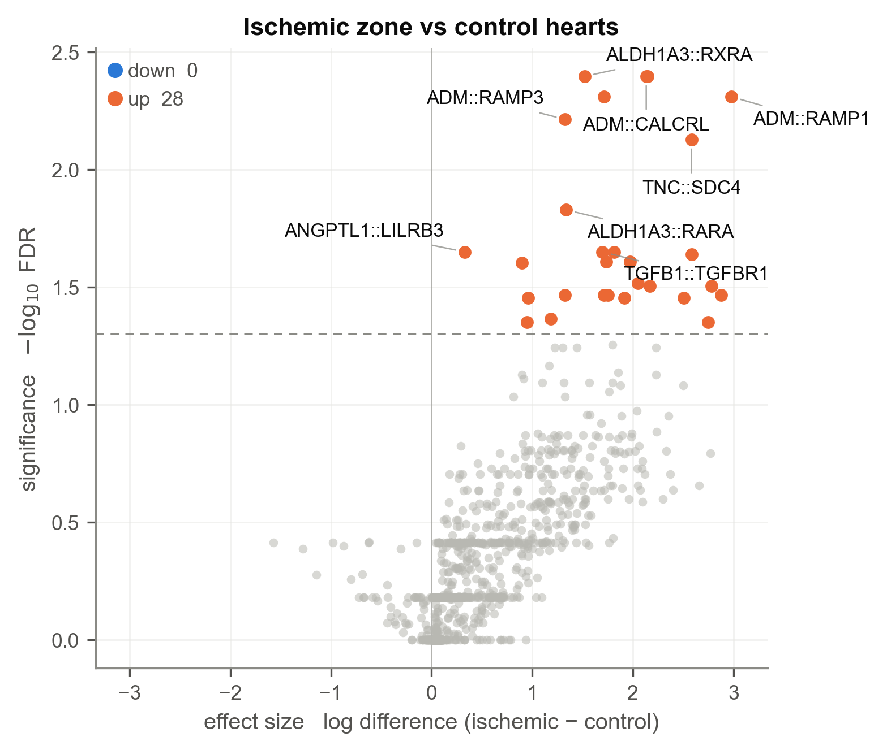
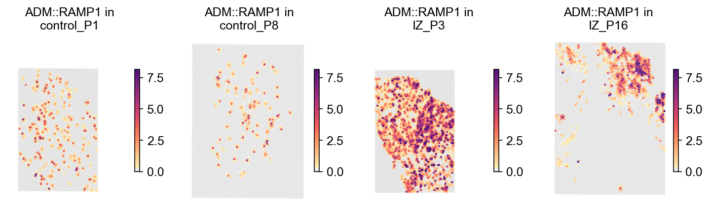

# compareLARIS tutorial: conditions from per-sample results (Visium myocardial infarction)

Comparing LARIS results across conditions with the **aggregate
estimator**: per-sample `runLARIS` tables in, statistics out — no merged
object, no raw data needed at comparison time. The example is the public
Kuppe et al. myocardial-infarction Visium cohort (human hearts; ischemic-
zone and control slides). All outputs were produced by exactly this code
with LARIS v0.11.0.

**Data**: Kuppe et al. 2022, *Spatial multi-omic map of human myocardial
infarction* — Visium slides available via cellxgene (collection
`8191c283`) as per-slide `.h5ad` files with spatial coordinates and cell
type annotations.

## 1. Run LARIS per slide

Each slide is one sample; run the standard pipeline per slide and keep
the cell-type results table. p-values can be skipped here — the
comparison does its own inference across subjects.

```python
import scanpy as sc
import laris as la

lr_df = la.datasets.lrDatabase(species="human")

results = {}
for slide in slides:                       # e.g. IZ_P3, control_P1, ...
    adata = sc.read_h5ad(f"data/kuppe/{slide}.h5ad")
    lr_data = la.tl.prepareLRInteraction(adata, lr_df,
                                         use_rep_spatial="X_spatial")
    _, res = la.tl.runLARIS(lr_data, adata,
                            use_rep="X_spatial",
                            use_rep_spatial="X_spatial",
                            groupby="cell_type",
                            calculate_pvalues=False)
    results[slide] = res
```

## 2. Compare ischemic zone vs control

`compareLARIS` takes the results dict plus two maps: sample → condition
and sample → subject. **The subject map matters**: several slides can
come from one patient, and slices of one subject are averaged before
testing so the patient — not the slide — is the unit of inference.
Per-sample score scales (LARIS's own rescaling, depth, batch) cancel
exactly through the internal centring, so raw result tables can be
compared directly.

```python
lr_cmp, triple_cmp = la.tl.compareLARIS(
    results,
    conditionMap={"IZ_P3": "IZ", "control_P1": "control", ...},
    referenceCondition="control",
    sampleToSubject={"IZ_P3": "P3", "control_P1": "P1", ...})
```

```text
tested 974 LR pairs; 28 at FDR<0.05
```

```python
lr_cmp[lr_cmp.pvalue.notna()].nsmallest(6, "pvalue")[
    ["interaction_name", "log_diff", "pvalue", "pvalue_fdr",
     "n_detected_ref", "n_detected_alt"]]
```

```text
interaction_name  log_diff  pvalue  pvalue_fdr  n_detected_ref  n_detected_alt
   ALDH1A3::RXRA    1.5195     0.0      0.0040               2               4
     ADM::CALCRL    2.1314     0.0      0.0040               1               4
      ADM::RAMP2    2.1464     0.0      0.0040               1               4
       PGF::FLT1    1.7115     0.0      0.0049               4               4
      ADM::RAMP1    2.9775     0.0      0.0049               1               4
      ADM::RAMP3    1.3265     0.0      0.0061               1               4
```

The leading axis is adrenomedullin to its receptors
(ADM::CALCRL/RAMP1/2/3) — the hypoxia-induced vasodilator programme —
alongside PGF::FLT1 (ischaemic angiogenesis): canonical post-infarct
biology, up in the ischemic zone in every patient.

The `n_detected_*` columns report in how many subjects each interaction
was seen at all. When one condition never detects an interaction, the
t-test would be meaningless (it would compare real scores to a column of
floor values), so those rows are automatically tested with **Fisher's
exact test on the detection counts** instead (`test_method =
'fisher_detection'`).

## 3. Volcano

```python
la.pl.plotCompareLARIS(lr_cmp, condition_labels=("control", "ischemic"),
                       title="Ischemic zone vs control hearts")
```



## 4. Look at the hits on the tissue

Always inspect a differential hit spatially before believing it. With
PIASO installed, `plot_embeddings_split` draws one panel per slide from
the concatenated cell-level scores (`basis` set to the spatial
coordinates):

```python
import piaso
piaso.pl.plot_embeddings_split(lr_all, color="ADM::RAMP1",
                               splitby="slide", basis="spatial", ncol=4)
```



ADM::RAMP1, the top adrenomedullin hit, is near-absent in the control
slides and broadly active through the ischemic tissue.

`triple_cmp` holds the same statistics per (sender, receiver, LR) triple
for directional cell-type claims; `plotCompareLARIS(triple_cmp,
sender=..., receiver=...)` draws one cell-type pair of it.

## Notes

- **What this estimator measures**: change in the subject's interaction
  profile, cell-type composition *included*. If composition itself may
  differ between conditions, see the
  [matched estimator tutorial](03_comparelaris_matched_merfish_gut.md) —
  and consider running both and combining
  (`la.tl.combineComparisons`).
- **Effect sizes** (`log_diff`) are differences of per-sample-centred
  log scores: invariant to any per-sample multiplicative factor, at any
  sparsity, via the scale-equivariant floor (`logPseudocount='auto'`).
- **Fixing the tested set**: `universe=[...]` restricts testing and the
  FDR burden to a named interaction list — useful for pre-registered
  hypotheses or for making two runs answer over identical hypotheses.
  Effect sizes are unaffected (the centring always uses the full data).
