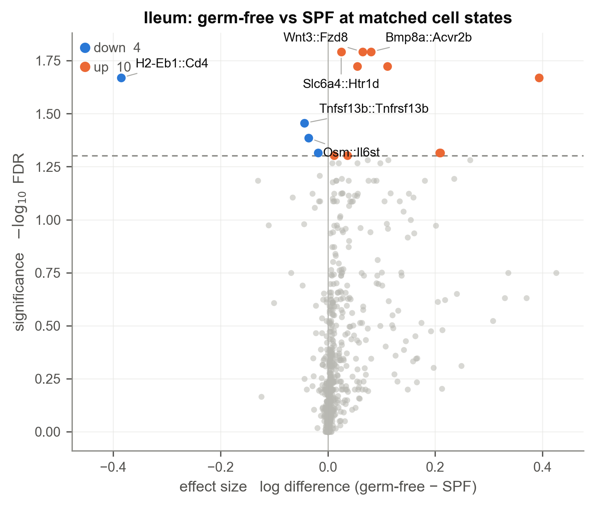
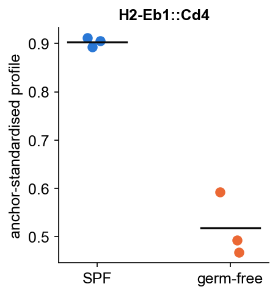
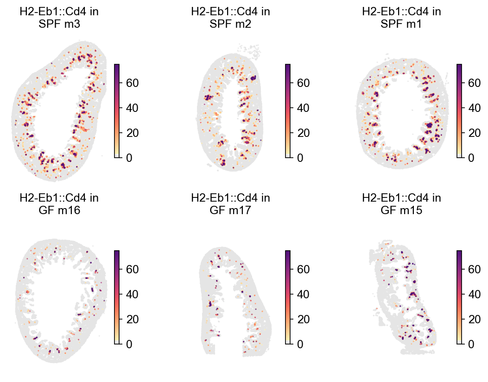

# compareLARIS tutorial: conditions at matched cell states (MERFISH gut atlas)

The **matched estimator**: comparing conditions on the cell-level LR
score matrices, at *matched cell states* — so a condition that merely has
more of some cell type does not masquerade as a signalling change. The
example is the public MERFISH atlas of the murine gut (2.1M cells,
specific-pathogen-free vs germ-free mice), restricted here to the ileum.
All outputs were produced by exactly this code with LARIS v0.12.0.

**Data**: An image-based transcriptomics atlas of the murine gut
(Cell Host & Microbe 2026); MERFISH measurements on Dryad,
[doi:10.5061/dryad.p5hqbzm0z](https://doi.org/10.5061/dryad.p5hqbzm0z)
(`cell_by_gene_with_metadata.h5ad`: 2,060,051 cells × 1,815 genes, with
per-cell region, microbiome status, mouse ID, slice ID and spatial
coordinates).

## 1. Per-slice LR scores, kept at cell level

As in the aggregate workflow, run `prepareLRInteraction` per slice — but
keep the returned cell-level objects and concatenate them. The panel is
receptor-focused (68% receptor but only 36% ligand coverage of the
database), which is exactly the targeted-panel regime for
`specificity_reference='all'` in any `runLARIS` calls.

```python
import anndata as ad
import scanpy as sc
import laris as la

try:                                   # optional: PIASO figure styling
    import piaso
    piaso.settings.set_figure_params()
except ImportError:
    pass
```

> Upstream of LARIS, PIASO's
> [spatial tutorials](https://piaso.org/tutorials/spatial-xenium/) cover QC,
> clustering, annotation, RNA regulon analysis and visualization for
> data like this.

```python

atlas = sc.read_h5ad("data/cell_by_gene_with_metadata.h5ad", backed="r")
lr_db = la.datasets.lrDatabase(species="mouse")
panel = set(atlas.var_names)
lr_df = lr_db[lr_db.ligand.isin(panel) & lr_db.receptor.isin(panel)]

parts = []
for s in ileum_slices:                          # obs['slice_full_name']
    sub = atlas[atlas.obs["slice_full_name"] == s].to_memory()
    sub.X = sub.layers["raw_counts"].copy()
    sub.obsm["X_spatial"] = sub.obs[["x [μm]", "y [μm]"]].to_numpy()
    part = la.tl.prepareLRInteraction(sub, lr_df,
                                      use_rep_spatial="X_spatial")
    part.obs[["slice_full_name", "microbiome", "dataset_ID"]] = \
        sub.obs[["slice_full_name", "microbiome", "dataset_ID"]].values
    parts.append(part)
lr_all = ad.concat(parts, join="inner")
```

## 2. A joint embedding across all slices

The matched estimator reads every mouse at a common set of cell-state
anchors, so it needs one embedding computed over all cells together.
`buildJointEmbedding` is the one-liner; `method='harmony'` (needs
`harmonypy`), `method='gdr'` (PIASO's marker-guided reduction, needs
`piaso` and a cluster column — the natural choice inside the PIASO
ecosystem, typically after `piaso.tl.infog` normalization), or
`method='pca'` (no extra dependency). On our validations the three gave
near-identical comparison results, so this is preference, not
correctness.

```python
la.tl.buildJointEmbedding(lr_all_expression, batch_key="slice_full_name",
                          method="harmony")            # -> obsm['X_joint']
lr_all.obsm["X_joint"] = lr_all_expression.obsm["X_joint"]

# or, PIASO-style:
# la.tl.buildJointEmbedding(expr, batch_key="slice_full_name",
#                           method="gdr", groupby="cell_class")
```

## 3. Compare at matched states

Same entry point as the aggregate estimator — the AnnData input selects
the matched one. Mice are the subjects; slices of one mouse are pooled
into one profile.

```python
cmp_, profiles = la.tl.compareLARIS(
    lr_all,
    conditionKey="microbiome", referenceCondition="WT",   # WT = SPF
    sampleKey="slice_full_name", subjectKey="mouse",
    use_rep="X_joint")
```

```text
matched: tested 984, 14 at FDR<0.05 | aggregate: tested 156, 2 at FDR<0.05
```

```python
la.pl.plotCompareLARIS(cmp_, condition_labels=("SPF", "germ-free"),
                       title="Ileum: germ-free vs SPF at matched cell states",
                       n_labels=8)
```



The direction split is textbook microbiome immunology, recovered without
any immunological input: adaptive-immune interactions **down** in
germ-free (H2-Eb1::Cd4, the BAFF→TACI IgA axis Tnfsf13b::Tnfrsf13b,
Il15::Il2rg), epithelial/developmental signalling **up** (Wnt→Fzd,
Bmp8→Acvr2b, Tgfb3::Tgfbr2), plus the microbiota-dependent serotonin
axis Slc6a4::Htr1d.

`profiles` (subjects × LR pairs) is the per-mouse view behind any hit —
always look at it before trusting a call:

```python
profiles["H2-Eb1::Cd4"]        # one standardised value per mouse
```



And on the tissue, one slice per mouse. Sections are placed on their
chips independently, so raw coordinates put each panel at a different
offset (here the centroids span 10,360 x 4,914 um); align them first,
then split with three panels per row so SPF fills the top row and
germ-free the bottom:

```python
import piaso
piaso.pp.alignSpatialCoordinates(lr_all, groupby="mouse",
                                 spatial_key="X_spatial",
                                 key_added="X_spatial_aligned")
piaso.pl.plot_embeddings_split(lr_all, color="H2-Eb1::Cd4",
                               splitby="mouse", basis="X_spatial_aligned",
                               ncol=3)
```



The mucosal immune foci carrying H2-Eb1::Cd4 are dense in every SPF
mouse and collapse in every germ-free mouse.

`alignSpatialCoordinates` centres each group on its own centroid, which
only changes where panels are drawn, never within-sample geometry
(`with_std=True` additionally equalises apparent section size). Needs
piaso-tools >= 1.2.3.

## 4. Run both estimators and combine

The two estimators answer different questions — the aggregate includes
composition in the effect, the matched controls it away — and both can
run on this cohort. `combineComparisons` merges them into one p-value
per interaction with the **Cauchy combination test**, which stays valid
even though the two share the data:

```python
lr_cmp, _ = la.tl.compareLARIS(results_by_slice, conditionMap=...,
                               referenceCondition="WT",
                               sampleToSubject=...)     # aggregate
combined = la.tl.combineComparisons(lr_cmp, cmp_,
                                    suffixes=("_agg", "_mat"))
combined[combined.pvalue_fdr < .05]
```

```text
interaction_name  log_diff_agg  log_diff_mat  pvalue_combined  pvalue_fdr  concordant
     Fgf1::Fgfr4        0.0156        0.1108           0.0002      0.0153        True
     H2-Eb1::Cd4       -0.4025       -0.3856           0.0002      0.0153        True
   Tgfb3::Tgfbr2        2.9959        0.3938           0.0003      0.0153        True
     Thy1::Itgam        0.2021       -0.0112           0.0012      0.0430       False
   Tgfb2::Tgfbr2        0.3657        0.2653           0.0014      0.0430        True
    Tgfb3::Acvr1        0.8733        0.1122           0.0018      0.0460        True
```

`concordant` flags whether the two effects agree in sign. The concordant
hits (H2-Eb1::Cd4 with nearly identical effects in both estimators, the
Tgfb axes) are the strongest claims; a discordant hit like Thy1::Itgam —
aggregate-positive, matched-null — is telling you the change is
*compositional*, which is biology too, just a different kind.

## Notes

- **Which estimator, when**: the `compareLARIS` docstring carries the
  full comparison table. Short version — aggregate when you only have
  result tables or need sender→receiver claims; matched when cell-level
  data exists, compositions may differ, or n is small and power matters.
- **Memory**: the matched estimator streams per subject, so peak memory
  follows the largest mouse, not the cohort — atlas-scale objects are
  fine.
- **Negative controls**: with ≥4 subjects in a condition, re-run with a
  within-condition split (2 vs 2 mice relabelled as pseudo-conditions)
  through the same call — it should return ~nothing. This caught two
  earlier designs of this estimator; make it a habit.
- A donor contributing samples to *both* conditions is rejected with
  instructions (give condition-specific subject labels and interpret
  accordingly).
