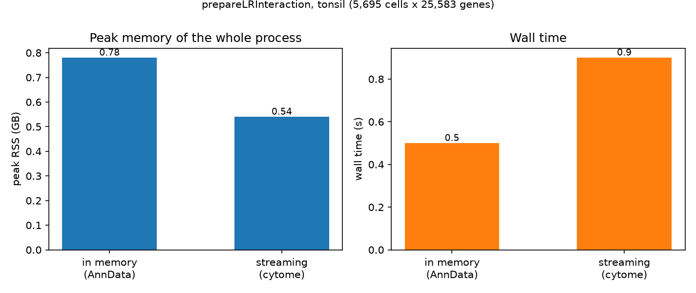

# Cytome usage guide: LARIS end to end on disk

LARIS accepts a [cytome](https://github.com/genecell/cytome) dataset — a
single-file, SQLite-backed format from the PIASO ecosystem — anywhere an
expression AnnData is expected, and for large data the whole pipeline can
stay on disk: scores are computed in blocks and written to an **LR
cytome** rather than materialised in memory. Install with
`pip install laris[cytome]`. All outputs below were produced by exactly
this code (tonsil data, LARIS v0.13.0).

## 1. Convert once

```python
import cytome
import laris as la

ds = cytome.from_anndata(adata, output="tonsil.cytome")
ds.close()
```

```text
tonsil.cytome: 88 MB on disk
```

## 2. Prepare LR scores — from the file, to a file

Give `prepareLRInteraction` the path. With a cytome input the return
follows the input (`return_type='auto'`): the scores are streamed to
disk as `tonsil.lr.cytome`, never fully in memory. Only the
ligand/receptor gene subset is ever read from the source file.

```python
lr_df = la.datasets.lrDatabase(species="human")
lr_path = la.tl.prepareLRInteraction("tonsil.cytome", lr_df)
lr_path
```

```text
'tonsil.lr.cytome'
```

The LR cytome reuses the registered RNA modality with the
ligand–receptor pairs as its feature table, and carries a single score
layer (there are no counts to store), so every cytome reader works on it
unchanged:

```python
ds = cytome.open(lr_path)
ds.list_matrices()
```

```text
['RNA_lrscore']
```

Options: `return_type='anndata'` to get an in-memory object from a
cytome source anyway; `output=` to choose the path; `overwrite=True` to
replace an existing file (never silent); `block_size=` to bound peak
memory for the AnnData path too.

## 3. Run LARIS from the files

Both arguments accept paths. Cell-type specificity is computed by
streaming the expression from disk in chunks (`cosg.run_cosg_cytome`) —
no cells × genes matrix is built:

```python
laris_lr, res = la.tl.runLARIS(
    lr_path, data="tonsil.cytome",
    use_rep="X_spatial", use_rep_spatial="X_spatial",
    groupby="cell_type")
```

```text
389,060 sender-receiver-LR rows; 1,345 at FDR<0.05
```

`cosg_backend='memory'` forces the in-memory path; `'auto'` streams only
for cytome sources, so AnnData users see no change.

## 4. Read the LR scores back when needed

```python
lr_back = la.pp.readLRCytome(lr_path)
```

```text
readLRCytome -> AnnData (5695, 1985), obsm ['X_pca', 'pca', 'X_spatial', 'spatial', 'X_umap', 'umap']
```

Embeddings come back under both their scanpy (`X_spatial`) and short
(`spatial`) spellings; tissue images stored in the cytome (cytome ≥
0.2.6) arrive in `uns['spatial']`, so `plotCCCSpatial` overlays them with
no extra argument. The plotting functions also accept the LR cytome path
directly as `lr_data=`.

## 5. The guarantee

The cytome path is not an approximation:

```python
lr_mem = la.tl.prepareLRInteraction(adata, lr_df)     # AnnData path
np.array_equal(lr_back.X.toarray(), lr_mem.X.toarray())
```

```text
bit-identical to the AnnData path: True
```

## 6. What it costs, measured

Both paths were run in separate processes so the peak memory is the
process's own, not whatever was already resident:

```python
# in memory
adata = sc.read_h5ad("adata_tonsil.h5ad")
lr_data = la.tl.prepareLRInteraction(adata, lr_df, use_rep_spatial="X_spatial")

# streaming, never holding the full matrix
la.tl.prepareLRInteraction("tonsil.cytome", lr_df, use_rep_spatial="X_spatial",
                           return_type="cytome", output="tonsil_lr.cytome",
                           block_size=512)
```



```text
h5ad 240.6 MB -> cytome 87.7 MB (conversion 2.5 s)
in memory : 0.78 GB peak, 0.5 s
streaming : 0.54 GB peak, 0.9 s
```

On a 5,695-cell tonsil the difference is small and the streaming path is
slightly slower - the honest summary is that at this size the two are
equivalent and you should use whichever is convenient. What the figure
shows is the *shape* of the trade: peak memory is bounded by the block
size rather than by the matrix, so it stays flat as the dataset grows,
while the in-memory bar grows with the data. That is why the on-disk
path matters at Visium HD, Stereo-seq and atlas scale, and why the file
is also 2.7x smaller on disk.

## Notes

- `laris.pp.readCytome(path, genes=[...])` streams an arbitrary gene
  subset into an AnnData — useful outside the LR workflow too.
- Works across cytome generations: files written before and after the
  cytome 0.3.0 layer-naming change (`{modality}_counts` reserved for raw
  integer counts) both resolve automatically; pass `layer=` to override.
- On-disk mode matters most at Visium HD / Stereo-seq / atlas scale; on
  a 5,695-cell tonsil it is simply equivalent.
