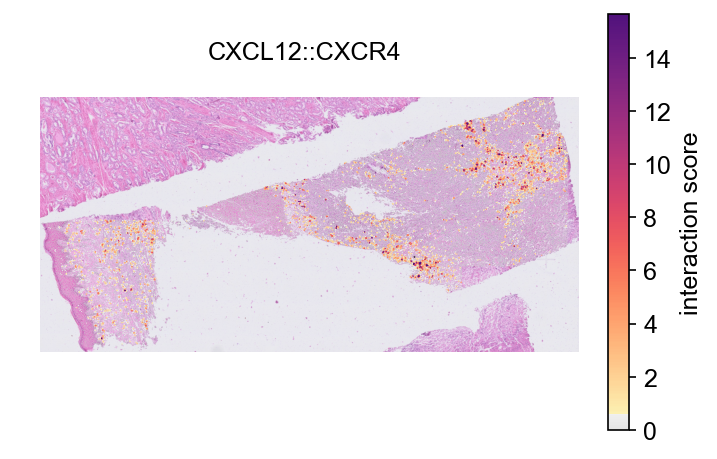
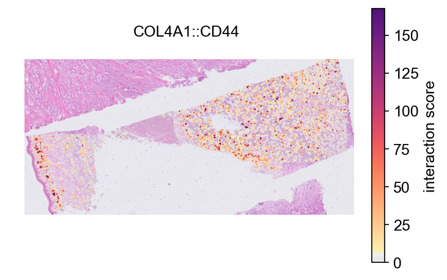
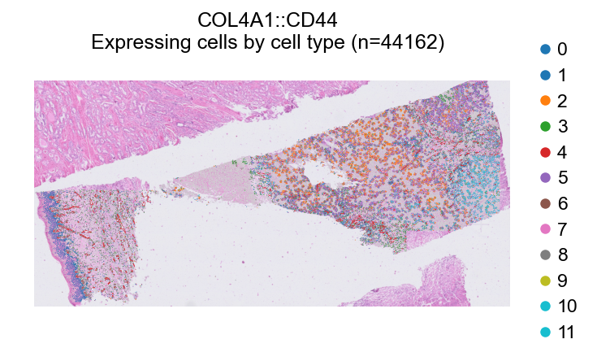

# Tissue image overlay on Xenium 5K (H&E, single-cell resolution)

Interaction scores drawn over the tissue image, on a 5,000-plex Xenium
Prime dataset. Two things this covers that a bundled-image platform does
not: a **post-hoc H&E** that must be registered into the assay's
coordinate frame first, and a **large gene panel**, which is where LR
analysis gets interesting (1,154 database pairs are measurable here
against roughly 300 on a standard Xenium panel). All outputs were
produced by exactly this code with LARIS v0.11.0.

**Data**: 10x Genomics,
[Xenium Prime 5K FFPE Human Skin](https://www.10xgenomics.com/datasets),
`Xenium_Prime_Human_Skin_FFPE` (human skin melanoma, 112,551 cells,
5,006 genes, Xenium Human 5K Pan Tissue & Pathways Panel). Only four
files are needed, about 1.7 GB in total, rather than the full 7.6 GB
bundle:

```
Xenium_Prime_Human_Skin_FFPE_cell_feature_matrix.h5    44 MB
Xenium_Prime_Human_Skin_FFPE_cells.csv.gz               7 MB
Xenium_Prime_Human_Skin_FFPE_experiment.xenium          2 KB
Xenium_Prime_Human_Skin_FFPE_he_image.ome.tif         1.7 GB
Xenium_Prime_Human_Skin_FFPE_he_imagealignment.csv      1 KB
```

> For QC, clustering, annotation, regulon analysis and spatial
> visualization of data like this, see PIASO's
> [spatial tutorials](https://piaso.org/tutorials/spatial-xenium/). The
> clustering below is deliberately minimal so the tutorial stays about
> the overlay.

## 1. Load cells and coordinates

```python
import json
import numpy as np
import pandas as pd
import scanpy as sc
import laris as la

D = "data/xenium_5k_skin"
meta = json.load(open(f"{D}/experiment.xenium"))
PIXEL = meta["pixel_size"]                     # microns per image pixel

adata = sc.read_10x_h5(f"{D}/cell_feature_matrix.h5")
adata.var_names_make_unique()
cells = pd.read_csv(f"{D}/cells.csv.gz").set_index("cell_id")
adata.obs = adata.obs.join(cells, how="left")
adata.obsm["X_spatial"] = adata.obs[["x_centroid", "y_centroid"]].to_numpy(float)
```

```text
112,551 cells x 5,006 genes (Xenium Human 5K Pan Tissue & Pathways Panel); pixel size 0.2125 um
12 clusters, 109,709 cells after QC
```

## 2. Run LARIS

The panel is targeted, so use `specificity_reference='all'` (LARIS warns
if you forget and too few database genes are present):

```python
lr_df = la.datasets.lrDatabase(species="human")
lr_data = la.tl.prepareLRInteraction(adata, lr_df,
                                     use_rep_spatial="X_spatial")
laris_lr, res = la.tl.runLARIS(lr_data, adata,
                               use_rep="X_spatial",
                               use_rep_spatial="X_spatial",
                               groupby="cluster",
                               specificity_reference="all")
```

```text
lr_data: 109,709 cells x 1,154 LR pairs
166,176 sender-receiver-LR rows; 519 at FDR<0.05
```

## 3. Register the post-Xenium H&E

The H&E is imaged after the run, so it sits in its own pixel frame
(rotated about 90 degrees here). 10x ships an affine matrix mapping H&E
pixels to Xenium pixels; applying it makes the image axis-aligned with
the cell coordinates, which is what an extent-based overlay needs. Work
from a pyramid level rather than full resolution.

```python
import tifffile
from scipy import ndimage

M = pd.read_csv(f"{D}/he_imagealignment.csv", header=None).to_numpy(float)
with tifffile.TiffFile(f"{D}/he_image.ome.tif") as tf:
    levels = tf.series[0].levels
    lvl = 4                                    # ~2,237 x 1,167 px
    he = levels[lvl].asarray()
    ds = levels[0].shape[0] / levels[lvl].shape[0]     # 16x downscale

RES = 4.0                                      # microns per output pixel
xy = adata.obsm["X_spatial"]
out_shape = (int(xy[:, 1].max() * 1.02 / RES), int(xy[:, 0].max() * 1.02 / RES))

A = np.linalg.inv(M)                           # Xenium px -> H&E px
k = RES / (PIXEL * ds)
matrix = np.array([[A[1, 1] * k, A[1, 0] * k],
                   [A[0, 1] * k, A[0, 0] * k]])
offset = np.array([A[1, 2] / ds, A[0, 2] / ds])
he_aligned = np.stack([
    ndimage.affine_transform(he[..., ch], matrix, offset=offset,
                             output_shape=out_shape, order=1, cval=255)
    for ch in range(he.shape[-1])], axis=-1).astype(np.uint8)

scale_factor = 1.0 / RES                       # image pixels per micron
```

```text
H&E level 4 (2237, 1167, 3) warped into the Xenium frame -> (1096, 2314, 3) at 4.0 um/px, scale_factor 0.25
```

## 4. Overlay

`img=` takes the registered image and `scale_factor=` its resolution in
image pixels per coordinate unit:

```python
la.pl.plotCCCSpatial(lr_data, "X_spatial", "CXCL12::CXCR4",
                     color_by="score", size=3,      # default 120 hides the H&E
                     img=he_aligned,
                     scale_factor=scale_factor, alpha_img=0.85)
```



The CXCL12::CXCR4 axis concentrates in the dermal and stromal
compartments, with the epidermis largely quiet.

```python
top = res.nlargest(1, "interaction_score").interaction_name.iloc[0]   # COL4A1::CD44
la.pl.plotCCCSpatial(lr_data, "X_spatial", top, color_by="score", size=3,
                     img=he_aligned, scale_factor=scale_factor)
```



The cell-type mode takes the same image arguments, so cluster
highlighting can be read against the histology:

```python
la.pl.plotCCCSpatial(lr_data, "X_spatial", top, cell_type="cluster",
                     highlight_all_expressing=True, size=1.5,
                     img=he_aligned, scale_factor=scale_factor)
```



## Notes

- **Bundled images need none of section 3.** For Visium and Visium HD
  read with `scanpy.read_visium`, the image and its scale factors live
  in `uns['spatial']`; `prepareLRInteraction` carries them into
  `lr_data`, and `plotCCCSpatial(..., color_by='score')` draws the
  tissue with no image argument at all. The same is true of images
  stored in a `.cytome` file (cytome 0.2.6 or later).
- **`size=` matters at single-cell resolution.** The default (120) is
  tuned for Slide-seq/Visium spot counts; with 100k+ Xenium cells it
  paints over the histology. Values around 1 to 3 keep the tissue
  readable underneath.
- **Stereo-seq ssDNA and other custom registrations** follow section 4
  directly: supply the registered array and its scale factor.
- `library_id=` selects the tissue in multi-library objects (an
  ambiguous request raises rather than guessing), `alpha_img=` fades the
  image, and `crop=False` keeps the full image extent.
- A missing optional decoder (Pillow, tifffile, imagecodecs) degrades to
  an imageless plot with a warning rather than failing.
