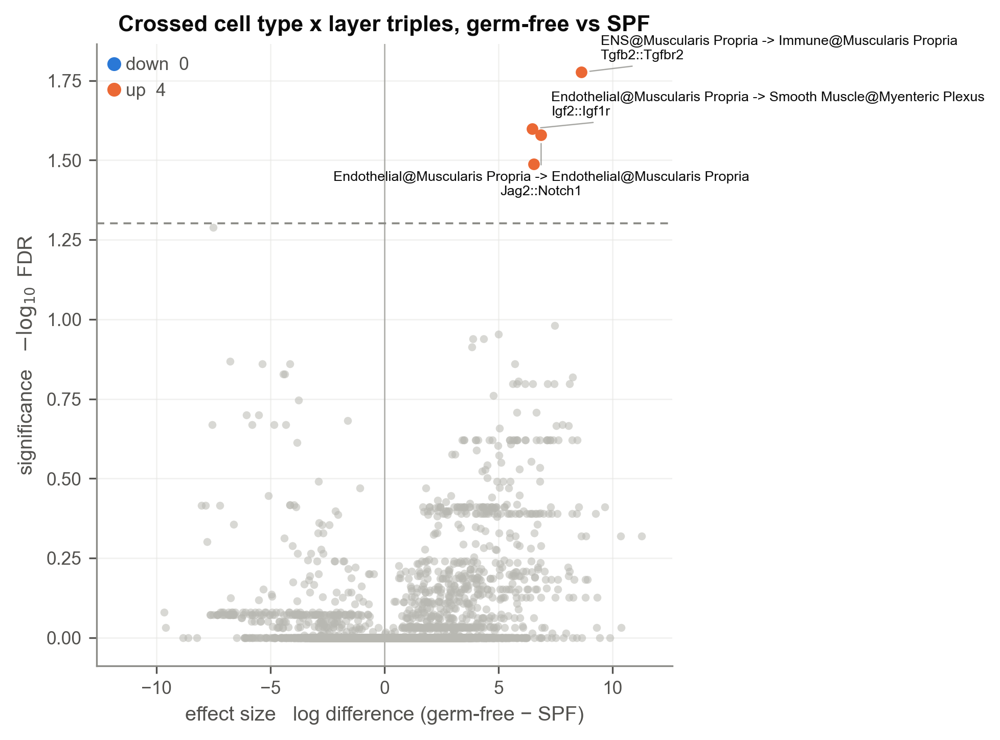
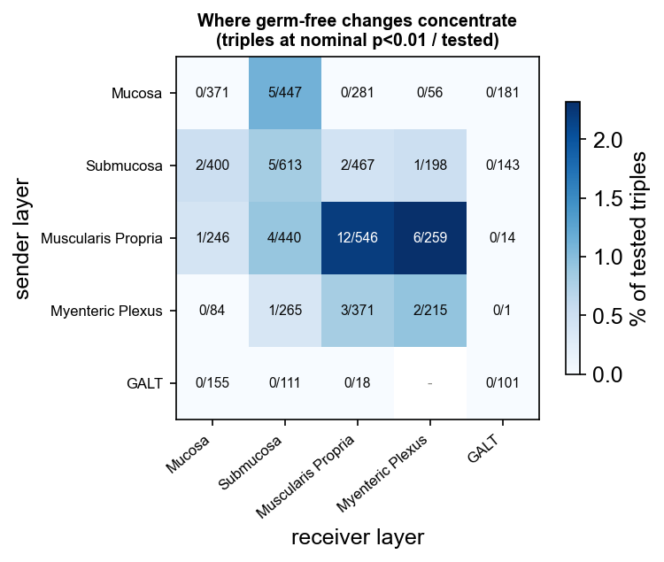
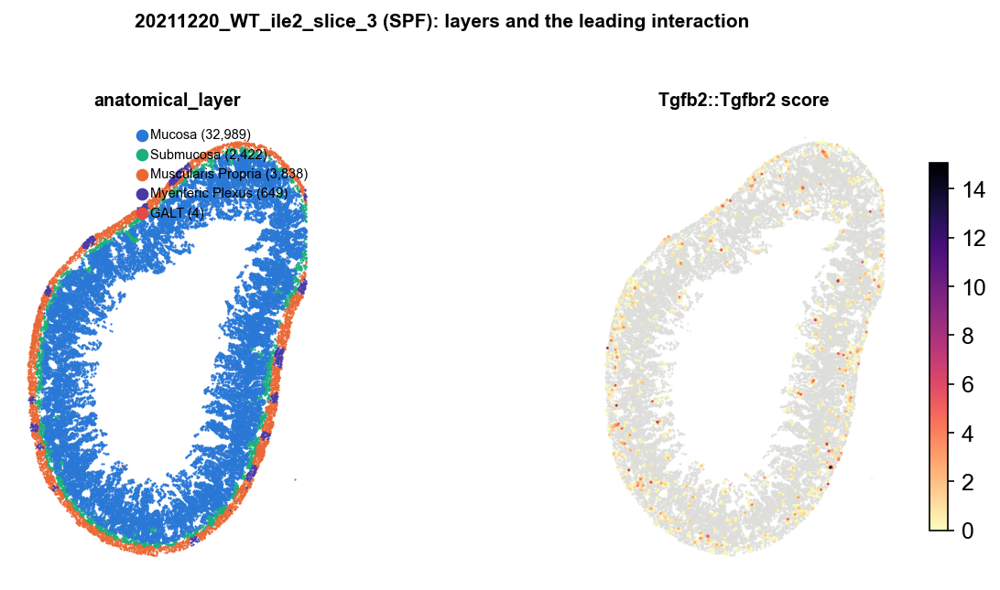

# Two-variable analysis: crossed category labels (cell type x region)

A common design has two grouping variables at once, for example cell
type and tissue region, and the question is which interactions change
per condition *within* a region. Two complementary strategies:

1. **Cross the labels**: combine cell type and region into one label
   (e.g. `Immune@Mucosa`) so the sender/receiver axis carries region
   identity through the whole pipeline.
2. **Subset**: restrict to one region and run `compareLARIS` within it.

This tutorial shows strategy 1 on the MERFISH gut atlas ileum
(SPF vs germ-free, `cell_class` x `anatomical_layer`), using PIASO's
`getCrossCategories` to build the crossed labels. All outputs were
produced by exactly this code with LARIS v0.11.0.

**Data**: the same gut atlas as
[tutorial 03](03_comparelaris_matched_merfish_gut.md)
(Dryad [10.5061/dryad.p5hqbzm0z](https://doi.org/10.5061/dryad.p5hqbzm0z));
`anatomical_layer` holds Mucosa, Submucosa, Muscularis Propria,
Myenteric Plexus and GALT.

## 1. Cross the labels, run per slice

```python
import pandas as pd
import laris as la
import piaso

for s in ileum_slices:              # one slice per mouse here
    sub = load_slice(s)             # raw counts + X_spatial, as in tutorial 03
    sub.obs["class_layer"] = piaso.pp.getCrossCategories(
        sub.obs, "cell_class", "anatomical_layer")
    sub.obs["class_layer"] = pd.Categorical(sub.obs["class_layer"])

    lr_data = la.tl.prepareLRInteraction(sub, lr_df,
                                         use_rep_spatial="X_spatial")
    _, res = la.tl.runLARIS(lr_data, data=sub,
                            use_rep="X_spatial",
                            use_rep_spatial="X_spatial",
                            groupby="class_layer",
                            calculate_pvalues=False,
                            specificity_reference="all")
    results[s] = res
```

```text
20211027_WT_ile_slice_2: 30,307 cells, 30 crossed groups
...
```

Crossing multiplies the group count (here about 30 = 7 cell classes x 5
layers, minus empty combinations), so the triple table grows
accordingly. Keep `calculate_pvalues=False`; the comparison below does
the inference.

## 2. Compare, with region-resolved triples

```python
lr_cmp, triple_cmp = la.tl.compareLARIS(
    results, conditionMap=cond, referenceCondition="WT",
    sampleToSubject=mouse_of)
```

```text
L1 tested 129; triples tested 5983
```

The triple table now answers region-resolved questions directly:

```python
triple_cmp[triple_cmp.pvalue.notna()].nsmallest(8, "pvalue")
```

```text
                        sender                        receiver interaction_name  log_diff  pvalue  pvalue_fdr
        ENS@Muscularis Propria       Immune@Muscularis Propria    Tgfb2::Tgfbr2    8.6358  0.0001      0.0167
Endothelial@Muscularis Propria  Smooth Muscle@Myenteric Plexus     Jag1::Notch2    6.5534  0.0003      0.0326
Endothelial@Muscularis Propria  Smooth Muscle@Myenteric Plexus      Igf2::Igf1r    6.4763  0.0003      0.0252
   Fibroblast@Myenteric Plexus         Smooth Muscle@Submucosa      Wnt2b::Fzd7   -7.5059  0.0004      0.0514
Endothelial@Muscularis Propria  Endothelial@Muscularis Propria     Jag2::Notch1    6.8688  0.0011      0.0264
        ENS@Muscularis Propria Interstitial@Muscularis Propria    Tgfb2::Tgfbr2    7.4664  0.0013      0.1046
 Fibroblast@Muscularis Propria     Fibroblast@Myenteric Plexus      Wnt9a::Lrp6    5.7122  0.0014      0.1378
        Interstitial@Submucosa            Smooth Muscle@Mucosa    Tgfb3::Tgfbr2    7.3985  0.0017      0.2393
```

The leading calls localize the germ-free changes anatomically: enteric
nervous system to immune Tgfb2 signalling specifically in the
muscularis, and endothelial Notch/Igf2 signalling at the myenteric
plexus. A plain cell-class analysis reports Tgfb up somewhere; the
crossed labels say where.

```python
la.pl.plotCompareLARIS(triple_cmp, effect_col="log_diff",
                       label_col="label",      # "sender -> receiver\nLR pair"
                       condition_labels=("SPF", "germ-free"),
                       title="Crossed cell type x layer triples")
```



Because every point is now a (cell type @ layer) pair, the volcano reads
anatomically. Aggregating the calls by layer shows where the germ-free
changes concentrate; the rate is shown rather than raw counts because
layer pairs contribute very different numbers of testable triples:



Muscularis Propria to itself (2.2%) and to the Myenteric Plexus (2.3%)
stand out against Mucosa to Mucosa (0%). With one slice per mouse and
roughly 6,000 triples only 4 clear FDR, so this panel uses nominal
p < 0.01 as a descriptive rate; treat it as a map of where to look, and
take calibrated per-LR calls from Level 1 or from
[tutorial 03](03_comparelaris_matched_merfish_gut.md).

The labels are worth plotting on the tissue too, next to the
interaction they localize:



Reading one interaction across layers works the same way:

```python
triple_cmp.query("interaction_name == 'H2-Eb1::Cd4'").nsmallest(6, "pvalue")
```

```text
              sender         receiver  log_diff  pvalue
  Endothelial@Mucosa    Immune@Mucosa   -4.4212  0.0551
   Epithelial@Mucosa Immune@Submucosa   -2.8628  0.1000
   Epithelial@Mucosa    Immune@Mucosa   -8.2260  0.1000
   Fibroblast@Mucosa Immune@Submucosa    2.8365  0.1163
Fibroblast@Submucosa Immune@Submucosa   -2.3928  0.1287
     Epithelial@GALT      Immune@GALT   -4.8382  0.1997
```

The H2-Eb1::Cd4 loss concentrates in the mucosa and GALT, exactly the
compartments where microbiota-driven antigen presentation lives. (With
one slice per mouse and 30 groups these per-triple tests are
underpowered; the trend is the point of this readout, the calibrated
per-LR calls come from Level 1 or from tutorial 03's matched estimator.)

## Notes

- PIASO's [spatial tutorials](https://piaso.org/tutorials/spatial-xenium/) cover
  the upstream steps (QC, clustering, annotation, regulon analysis)
  that produce the labels crossed here.
- `getCrossCategories(obs, col1, col2)` is PIASO's helper; without PIASO
  the same labels are one line of pandas:
  `obs["class_layer"] = obs["cell_class"].astype(str) + "@" + obs["anatomical_layer"].astype(str)`.
- Crossing shrinks the cells per group. Groups below
  `n_cells_expressed_threshold` contribute little; consider merging rare
  combinations first.
- Strategy 2 (subset to one region, then `compareLARIS` within it) is
  preferable when only one region is of interest, since it avoids the
  group explosion entirely.
- Deconvolved data: LARIS uses discrete labels, so with per-spot
  proportions use the dominant label per spot; where one cell type
  dominates everywhere, region or cluster labels usually carry more
  contrast.
