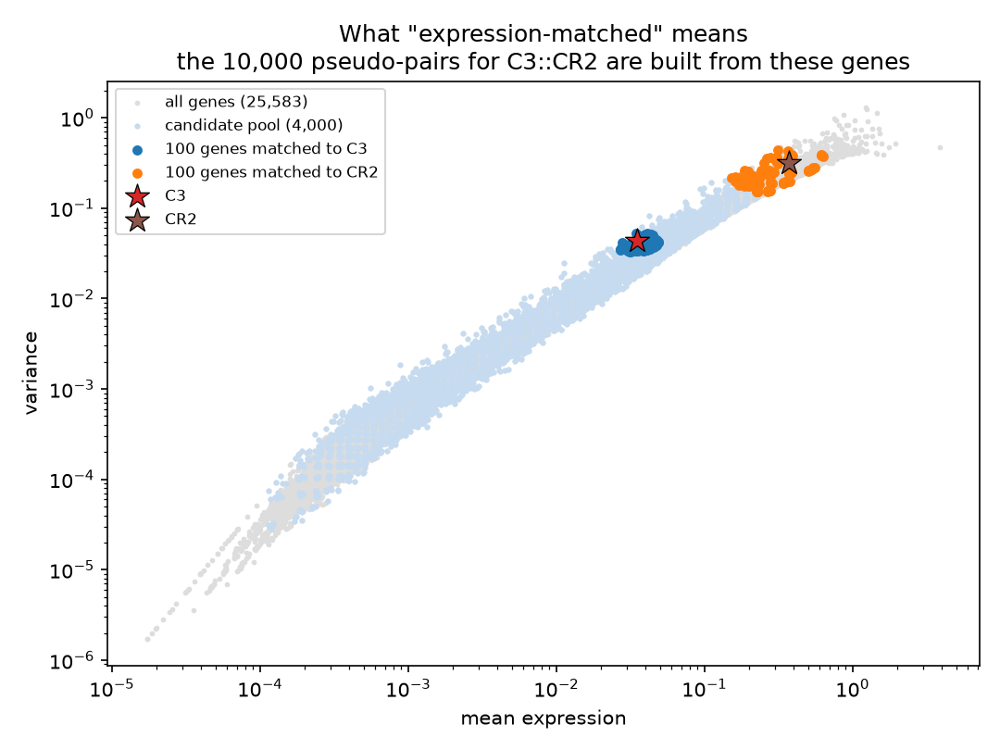
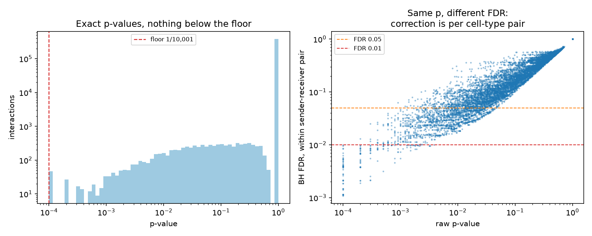
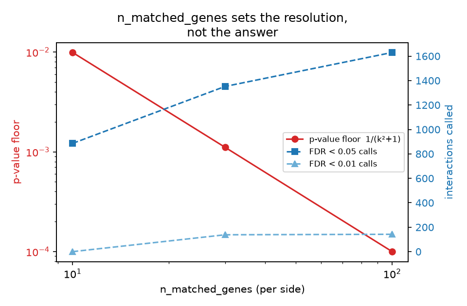

# Statistical significance: what the p-value tests, and how to get one

`runLARIS` ranks interactions by score whether or not you ask for
p-values. This tutorial is about the p-value: what question it answers,
how to compute one, and how to read the result honestly. All outputs
were produced by exactly this code with LARIS v0.13.0 on the Slide-tags
tonsil (Zenodo
[10.5281/zenodo.19981287](https://doi.org/10.5281/zenodo.19981287)).

## 1. The two-line version

```python
bg = la.tl.prepareLRBackground(adata, lr_df, use_rep_spatial="X_spatial")
laris_lr, res = la.tl.runLARIS(lr_data, adata,
                               use_rep="X_spatial",
                               use_rep_spatial="X_spatial",
                               groupby="cell_type",
                               background=bg)          # <- p-values
```

`prepareLRBackground` builds the reference the test compares against.
It is a separate step because it is the expensive part and it is
**reusable**: it depends only on the cells, the spatial graph and the
gene set, so one background serves every `groupby`, every parameter
sweep, and every re-run on the same object.

## 2. What the p-value actually tests

For each (sender, receiver, ligand::receptor) row the question is:

> Is this ligand-receptor pair more strongly and specifically
> co-organized between these two cell types than an
> **expression-matched pair of genes** would be?

The null is built by replacing the ligand with one of its
mean/variance-matched genes and the receptor with one of its own —
independently, so `n_matched_genes=100` per side gives **10,000
pseudo-pairs per real pair**. Each pseudo-pair is scored through the
*whole* pipeline (its own spatial specificity, its own detection
fractions, its own co-localization), and the p-value is the exact tail:

```
p = (# pseudo-pairs scoring at least as high + 1) / (# pseudo-pairs + 1)
```

Three consequences worth internalising:

- **It is exact and deterministic.** No sampling, no seed, no
  `n_permutations`. Re-running gives the same number.
- **The floor is 1/10,001 ≈ 1e-4** at defaults. A p-value equal to the
  floor means "beat every pseudo-pair", not "p = 0".
- **This is not a test of "is there any signal".** It is competitive:
  against expression-matched chance. A highly expressed, broadly
  co-expressed pair can score high and still be unremarkable *for its
  expression level* — that is the intended behaviour.

## 3. Running it, with real output

```python
import laris as la
import scanpy as sc

adata = sc.read_h5ad("adata_tonsil.h5ad")
lr_df = la.datasets.lrDatabase(species="human")
lr_df = lr_df[lr_df.ligand.isin(adata.var_names)
              & lr_df.receptor.isin(adata.var_names)]

lr_data = la.tl.prepareLRInteraction(adata, lr_df,
                                     use_rep_spatial="X_spatial")
bg = la.tl.prepareLRBackground(adata, lr_df, use_rep_spatial="X_spatial")
```

```text
  - pool grown 4,000 -> 4,108 genes so every LR gene has matched peers above it
  - candidate pool: 4,108 genes (quantile grid over mean/variance)
  - diffusing 4,824 genes through the 20-NN kernel graph...
  - building spatial-specificity graph and Gram tables...
  - done: 4,824 genes, support per pair 10,000 (floor 1.00e-04)
```

The background took about 5 minutes on this 5,695-cell dataset and is
the one-time cost; keep it in memory (or `pickle` it) and reuse.



This is what "expression-matched" means, for one pair. C3 and CR2
(stars) each receive 100 partners drawn from the candidate pool at the
same place in mean/variance space - the tight clouds around each star.
Every one of the 10,000 pseudo-pairs for `C3::CR2` is one blue gene
crossed with one orange gene, so the comparison controls for expression
level and variability instead of pitting the pair against arbitrary
genes.

Two things follow, and both matter when reading a result. Because the
matching is per gene, a *highly expressed* ligand is judged against
other highly expressed genes, so being abundant earns no significance
by itself. And because the two sides are drawn independently, the null
keeps each gene's own behaviour while destroying the pairing - which is
exactly the alternative hypothesis being tested.

```python
laris_lr, res = la.tl.runLARIS(lr_data, adata,
                               use_rep="X_spatial",
                               use_rep_spatial="X_spatial",
                               groupby="cell_type", background=bg)

res[res.p_value_fdr < 0.01].nsmallest(6, "p_value")[
    ["sender", "receiver", "interaction_name",
     "interaction_score", "p_value", "p_value_fdr"]]
```

```text
      sender receiver interaction_name  interaction_score  p_value  p_value_fdr
    B_memory      mDC   SEMA7A::PLXNC1           0.137342   0.0001       0.0053
T_double_neg      pDC    CD96::NECTIN1           0.060411   0.0001       0.0034
         MRC FDC_LZDZ          C3::CR2           0.037059   0.0001       0.0042
    B_memory    T_CD8    COL4A3::ITGA1           0.031627   0.0001       0.0021
    FDC_LZDZ      mDC       FN1::ITGA4           0.029726   0.0001       0.0028
    FDC_LZDZ B_memory       FN1::ITGA4           0.028849   0.0001       0.0038
```

`C3::CR2` from marginal reticular cells to follicular dendritic cells is
the germinal-centre antigen-trapping axis; `PDCD1LG2::PDCD1` from
macrophages to follicular helper T cells is the PD-1 checkpoint. Neither
was supplied as prior knowledge.



**Left**: every p-value is an exact tail count, so the distribution
stops at the floor and nothing lies below it. **Right**: the same raw
p-value maps to different FDRs, because Benjamini-Hochberg runs *within*
each sender-receiver pair - a p-value of 1e-4 in a pair with few tested
interactions clears a stricter threshold than the same p-value in a
crowded one.

## 4. Choosing `n_matched_genes`

This is the only parameter most users need to think about, and it sets
the resolution of the test:

| `n_matched_genes` | pseudo-pairs per real pair | p-value floor |
|---|---|---|
| 30 | 900 | 1.1e-3 |
| **100 (default)** | **10,000** | **1.0e-4** |
| 200 | 40,000 | 2.5e-5 |

Raise it only if you need to *report* thresholds below the floor. The
cost is in the assembly, not the background build, and matching quality
degrades slowly in gene space (the 100th-nearest gene by mean/variance
is still a close match; the 100th-nearest *pair* would not be).



Measured on the tonsil data, this is what the parameter does and does
not change:

| `n_matched_genes` | floor | FDR < 0.05 | FDR < 0.01 |
|---|---|---|---|
| 10 | 9.9e-3 | 650 | **0** |
| 30 | 1.1e-3 | 1,372 | 225 |
| 100 (default) | 1.0e-4 | 1,345 | 120 |

At `k = 10` the floor is 1/101, so **no interaction can reach FDR < 0.01
at all** - the zero in that row is arithmetic, not biology. Between
`k = 30` and `k = 100` the loose column barely moves (1,372 to 1,345)
while the strict column falls sharply (225 to 120): the larger support
resolves the tail better and withdraws calls the coarser lattice had let
through. The default is chosen to leave room below the thresholds people
actually quote. The default is chosen to leave room below the
thresholds people actually quote.

`n_pool` (default 4,000) sets how many genes the matched sets are drawn
from. The Gram tables are quadratic in the pool, so this is the memory
and build-time dial; the default is a good balance and covers the
mean/variance space on a quantile grid.

### Cost at scale

The pool is *augmented* with every covered database gene, so the table
dimension is roughly `n_pool` plus the number of LR genes present. That
is why an object with more genes costs more at the same `n_pool`, and why
halving `n_pool` helps so much - the tables are quadratic in it.
Build times reported by users and measured here:

| object | genes | `n_pool` | build |
|---|---|---|---|
| tonsil, 5,695 cells | 25,583 | 4,000 | ~200 s |
| tonsil, 5,695 cells | 25,583 | 2,000 | ~52 s |
| Visium HD, 68,616 bins | 18,085 | 4,000 | ~6,900 s |
| Stereo-seq, 145,400 cells | 27,694 | 4,000 | ~5,800 s |

One practical warning: on a machine under memory pressure from other
jobs, the same call can take several times longer while the CPU looks
idle. A tonsil background measured at 1,485 s on a loaded node and 203 s
on the same node once quiet. If a build seems inexplicably slow, check
the machine before the code.

## 5. Reading the results honestly

**Use the FDR column, not the raw p.** `p_value_fdr` is
Benjamini-Hochberg *within each sender-receiver pair*, because that is
the unit a result is reported in ("cell type A signals to cell type B
via L::R"). Different cell-type pairs have different specificity
profiles, so per-pair correction keeps each pair's threshold driven by
its own p-value distribution.

**The test is calibrated, and here is the check.** On data with no
structure to find - random counts, random coordinates, random labels -
the test returns **zero** interactions at FDR < 0.05; on data with a
planted spatially coherent interaction it recovers it with a small
p-value. Both are pinned in the test suite
(`test_calibration_on_noise`, `test_power_on_planted_signal`), and that
pair is the calibration control worth copying into your own. Note what
is *not* on the list: shuffling labels, shuffling coordinates, and
scoring a rewired database are none of them calibration checks -
[§6](#6-why-a-label-or-coordinate-shuffle-is-not-the-null) and
[§7](#7-what-the-database-contributes-measured) explain why.

**The floor and the FDR interact.** In a group of `m` tested
interactions where `k` reach the p-value floor, the smallest attainable
FDR is `(m/k) x floor`. With the default floor of 1e-4 this is rarely
binding, but LARIS warns when a group's isolated-hit bound exceeds
0.05.

**`p_value = 1.0` is meaningful**, not missing: it is what the test
returns when the interaction's matched-gene support has no positive
mass, i.e. there is no evidence either way.

**Check `null_matchability`.** It reports how saturated a pair's matched
sets are: the fraction of matched genes whose expression lies below the
real gene's. 0.5 is healthy. Values near 1.0 mean every matched gene is
weaker, so every pseudo-pair is weaker than the real pair and the
p-value overstates. `prepareLRBackground` grows the candidate pool until
this cannot happen, so values near 1 among called rows mean the
augmentation was disabled. On this dataset the highest value among
significant calls is 0.93.

**Check `pair_breadth`.** The fraction of sender-receiver combinations in
which a pair is called. Genuine cell-type-specific results are narrow;
here the maximum is 0.077. A pair called across more than about a
quarter of the grid carries no cell-type information, however real its
expression.

**Check `null_support` before trusting a small p-value.** The null has
`n_matched_genes ** 2` entries, but many of them score exactly zero
because their matched genes are not co-detected in the two groups. A
zero can never exceed a positive observed score, so it enlarges the
denominator without adding resolution. `null_support` counts the
pseudo-pairs that scored above zero, and it is the null's *effective*
resolution: a row with `null_support = 100` reporting `p = 1e-4` is
really only resolving about `1e-2`. `runLARIS` warns when more than 5%
of tested rows fall below 100, and `min_null_support=` drops them.

## 6. Why a label or coordinate shuffle is not the null

This is the most common way to mis-calibrate a LARIS run, so it is worth
being precise about.

Gene-set testing distinguishes two kinds of null hypothesis (Goeman &
Bühlmann 2007):

| | asks | calibrated by |
|---|---|---|
| **self-contained** | is this set associated with the phenotype at all? | **sample** permutation (shuffle labels) |
| **competitive** | is this set more associated than comparable genes? | **gene** permutation |

LARIS's p-value is **competitive**: the reference is 10,000
expression-matched pseudo-pairs. Its null is therefore generated by
permuting *gene identity*, and shuffling cell-type labels or spatial
coordinates is the calibration procedure for the other kind of test.
CellPhoneDB and CellChat shuffle labels precisely because their
statistics are self-contained; the two schemes are not interchangeable.

Concretely, if you shuffle labels, every group converges to the tissue
average, so the cell-type factors in the score converge to the same
constant for every gene — and a constant **cancels between the observed
score and its null**. What remains is a comparison of spatial
co-expression, which real database pairs win on merit because they are
genuinely co-expressed genes. Measured on the Slide-tags tonsil:

| tonsil | FDR<0.05 | FDR<0.01 |
|---|---|---|
| real labels | 1,345 | 120 |
| labels shuffled | 54 | 11 |
| coordinates shuffled | 1,373 | 179 |

The two controls behave very differently, and the difference is the
point. Shuffling **labels** destroys the cell-type structure the score
is built on, and the calls collapse. Shuffling **coordinates** barely
moves the count at all - because the null is rebuilt in the same shuffled
world, so both the observed pair and its 10,000 pseudo-pairs lose their
spatial structure together and the comparison between them survives.

A coordinate shuffle is therefore not a failed sanity check; it is a
competitive test doing exactly what it says. Neither shuffle is this
test's null.

**Two things this means in practice.** Do not read a coordinate shuffle
as a failed sanity check. And do not compare *rescaled*
`interaction_score` values across runs **directly**: scores are rescaled
per run so the top-100 mean is 0.1, which makes the same numeric
threshold a different bar in each. Cross-run comparison is supported, it
just needs the factor divided out - every run records its own in
`celltype_results.attrs['laris_scale_factor']` (and
`lr_adata.uns['laris_scale_factor']`), so dividing each run's scores by
its factor puts them back on a common scale. Passing `rescale=False`
sets the factor to 1.0 and skips the step entirely.

### The control that does apply

If neither shuffle is the null, what is? A dataset with **no structure to
find**. That is the calibration check, and it is the one in our own test
suite:

- **Noise returns nothing.** A random count matrix with random
  coordinates and random labels yields **zero** interactions at
  FDR < 0.05, with the raw p-values centred near the middle of their
  range (`tests/test_factorized_null.py::test_calibration_on_noise`).
- **Planted signal is found.** A spatially coherent ligand blob in cell
  type A next to a receptor blob in B is recovered with a small p-value
  (`test_power_on_planted_signal`).

Those two together are the calibration story: the test finds structure
that is there and none that is not. If you want a control in your own
suite, that pair is the one to copy.

### What the decoy database is *not*

`permuteLRPairs` rewires the database so that only the *pairing* changes.
It is tempting to read that as a pass/fail control — every decoy pair is
"wrong", so surely a calibrated run should return almost none of them.

**It does not, and that is not a defect.** On the tonsil data a rewired
database recovers most of what the real one calls. The reason is the
subject of the next section: the p-value tests how a pair's expression is
*arranged*, and a rewired pair of two genes with the same marker
structure is arranged just as well. The decoy is therefore a
**measurement of what the database contributes**, not a check that your
run is calibrated — see [§7](#7-what-the-database-contributes-measured),
which is where it belongs.

## 7. What the database contributes, measured

Everything above is about *arrangement*: whether a pair's expression is
laid out specifically between two cell types. None of it tests the
**pairing** — whether this ligand actually binds this receptor. That
comes from the database, not from your data, and it is worth knowing how
much of a result rests on it.

The measurement is the one proteomics uses for the same problem: score a
decoy database alongside the real one. `permuteLRPairs` rewires the
database by repeated double-edge swaps, so every gene appears in exactly
as many pairs as before and only the pairing changes.

```python
q, decoy_res = la.tl.computeDecoyFDR(
    adata, lr_df, res, background=bg,          # the SAME background
    prepare_kwargs={"use_rep_spatial": "X_spatial"},
    run_kwargs={"use_rep": "X_spatial", "use_rep_spatial": "X_spatial",
                "groupby": "cell_type"})
la.tl.decoyReport(res, decoy_res)
```

```text

==================================================================
TARGET-DECOY REPORT — what the database contributes
==================================================================
  The p-value tests how the pair's expression is ARRANGED with respect
  to the cell types. The PAIRING itself comes from the database, not
  from the data. A rewired database scored the same way shows how much
  of the result chance pairing alone reproduces here.

  FDR < 0.05   real database   1,345 calls   |  rewired   1,241   |  estimated pairing-FDR 0.99
  FDR < 0.01   real database     120 calls   |  rewired     109   |  estimated pairing-FDR 0.98

  Best attainable pairing-FDR on this dataset: 0.886
  Read as: of the calls at this threshold, roughly this fraction are
  matched by a database whose pairings are random. High values do not
  mean the interactions are absent - they mean the DATA cannot
  distinguish this pairing from a comparable one, so the evidence for
  the pairing rests on the database. See tutorial 07.
==================================================================
```

That is a high number, and it is the honest one. It does **not** mean
these interactions are absent — `C3::CR2` between marginal reticular
cells and follicular dendritic cells is real germinal-centre biology.
It means the *data* cannot distinguish that pairing from a comparable
one: C3 marks MRC, CR2 marks FDC, those cell types are adjacent, and a
rewired pair of two genes with the same marker structure looks the same
to any expression-based method. The evidence for the pairing is the
database; the evidence for the arrangement is the p-value.

This limit is shared by every expression-based cell-cell communication
method. LARIS reports it rather than leaving it implicit. Practically:
use the p-value to rank and localise interactions *from your database*,
and cite the database for the interaction itself.

One reusable note: the decoy run needs no second background. The
rewiring preserves the exact gene multiset, so every matched set is
identical and one `prepareLRBackground` serves both runs.

## 8. Without a background

`runLARIS(..., calculate_pvalues=True)` without `background=` still
runs, using the older resampled-pair null. It is kept for one release
so existing scripts do not break, but its p-values have a coarse
support and should not be used for new work — see the v0.12.0 and
v0.13.0 release
notes.

If you only need a ranking, `calculate_pvalues=False` skips the whole
question and is much faster.

## Notes

- **Reuse**: `bg` is independent of `groupby`, `mu` and
  `spatial_weight`. Building it once and passing it to several
  `runLARIS` calls (different cell-type annotations, parameter sweeps)
  is the intended pattern.
- **Cytome**: `prepareLRBackground` accepts a `.cytome` path or open
  dataset, and streams the gene statistics rather than loading the full
  matrix.
- **Sections**: pass the same `section_key` you pass to
  `prepareLRInteraction`, so the background's graphs respect the same
  section boundaries.
- **Speed**: wheels ship compiled Rust kernels used automatically. Set
  `LARIS_NO_RUST=1` to force the pure-NumPy path (identical results).
