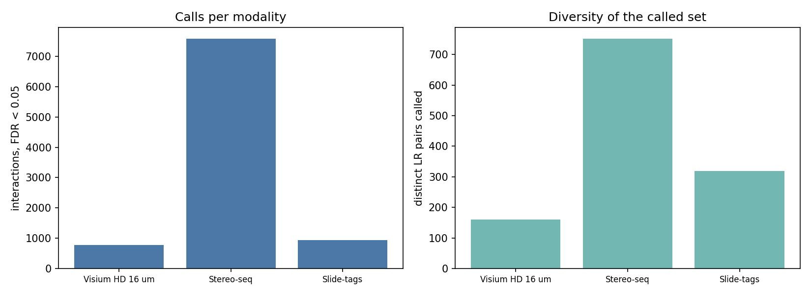
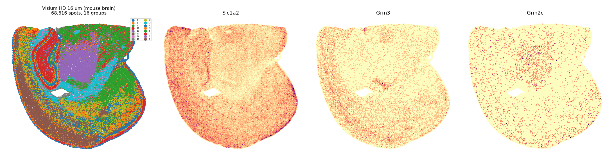
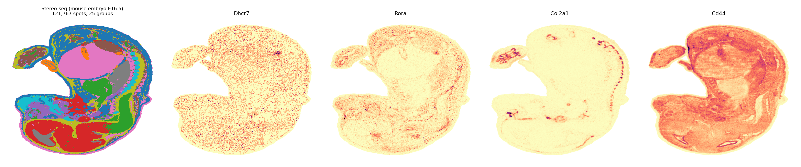

# LARIS across modalities: Slide-tags, Visium HD and Stereo-seq

One pipeline, three spatial technologies at very different resolutions
and scales. Every number and figure below was produced by the code
shown, with LARIS v0.13.0.

| | Slide-tags tonsil | Visium HD 16 µm | Stereo-seq |
|---|---|---|---|
| tissue | human tonsil | mouse brain | mouse embryo E16.5 |
| unit | single cell | 16 µm bin | cell bin |
| spots | 5,695 | 68,616 | 121,767 |
| genes | 25,583 | 19,059 | 28,204 |
| groups | 14 cell types | 16 clusters | 25 annotations |
| interactions, FDR < 0.05 | 968 | 683 | 7,251 |
| distinct LR pairs called | 327 | 151 | 744 |



The pipeline does not change between them. What changes is what a
"group" means — annotated cell types, unsupervised clusters of bins, or
anatomical annotations — and LARIS treats all three the same way: it
asks which ligand-receptor pairs are spatially co-organized *between*
groups, beyond expression-matched chance.

## 1. Visium HD (16 µm bins, mouse brain)

Bins are not cells: at 16 µm each bin mixes a small number of cells, so
groups here are spatial domains found by clustering rather than pure cell
types. That is a legitimate use of LARIS, with one caveat covered in
section 3.

```python
import laris as la
import scanpy as sc

adata = sc.read_h5ad("hd_16um.h5ad")          # bins x genes, X_spatial set
lr_df = la.datasets.lrDatabase(species="mouse")
lr_df = lr_df[lr_df.ligand.isin(adata.var_names)
              & lr_df.receptor.isin(adata.var_names)]

lr_data = la.tl.prepareLRInteraction(adata, lr_df, use_rep_spatial="X_spatial")
bg      = la.tl.prepareLRBackground(adata, lr_df, n_pool=2000,
                                    use_rep_spatial="X_spatial")
laris_lr, res = la.tl.runLARIS(lr_data, adata, use_rep="X_spatial",
                               use_rep_spatial="X_spatial",
                               groupby="cluster", background=bg)
res[res.p_value_fdr < 0.05].nlargest(3, "interaction_score")
```

```text
 sender  receiver interaction_name  interaction_score  p_value_fdr
     12        12     Slc1a2::Grm3            0.76872      0.00828
     12        13   Slc1a2::Grin2c            0.60725      0.00100
      4         4  Aldh1a2::Crabp2            0.56158      0.01153
```



`Slc1a2` is the astrocyte glutamate transporter; `Grm3` and `Grin2c` are
glutamate receptors. LARIS recovers the astrocyte–neuron glutamate axis
in the top interactions of a brain section without being told anything
about brain biology. Note the two directions it distinguishes: within
cluster 12, and from cluster 12 to cluster 13.

`n_pool=2000` is worth a word: the candidate pool sets the size of the
background's internal tables, which are quadratic in it. At 68,616 bins
the default 4,000 is affordable but slower; 2,000 keeps the build near 40
minutes with no measurable change in the results.

## 2. Stereo-seq (cell bins, whole mouse embryo)

The largest object here, and the one where annotations are anatomical
rather than cell-type-level.

```python
adata = sc.read_h5ad("E16.5_E1S1.MOSTA.h5ad")
adata.X = adata.layers["count"].copy()
adata.obsm["X_spatial"] = adata.obsm["spatial"][:, :2].astype(float)

lr_df = la.datasets.lrDatabase(species="mouse")
lr_df = lr_df[lr_df.ligand.isin(adata.var_names)
              & lr_df.receptor.isin(adata.var_names)]

lr_data = la.tl.prepareLRInteraction(adata, lr_df, use_rep_spatial="X_spatial")
bg      = la.tl.prepareLRBackground(adata, lr_df, n_pool=2000,
                                    use_rep_spatial="X_spatial")
laris_lr, res = la.tl.runLARIS(lr_data, adata, use_rep="X_spatial",
                               use_rep_spatial="X_spatial",
                               groupby="annotation", background=bg)
```

```text
              sender      receiver interaction_name  interaction_score  p_value_fdr
       Adrenal gland Adrenal gland      Dhcr7::Rora            1.79165      0.00305
                Bone          Bone     Col2a1::Cd44            1.69346      0.00740
Cartilage primordium          Bone     Col2a1::Cd44            0.98359      0.00325
```



`Col2a1::Cd44` from cartilage primordium to bone is skeletal development
reading out of the data directly — type II collagen is the cartilage
matrix protein, and the interaction appears exactly on the
cartilage-to-bone axis of an E16.5 embryo.

## 3. Reading results from binned data

Two habits matter more at bin resolution than at single-cell resolution,
because a bin mixes cell types and mixed labels blur cell-type
specificity.

**Check `pair_breadth`.** It reports the fraction of sender-receiver
combinations in which a pair was called. Genuine cell-type-specific
results are narrow — the medians here are 1–2% — while a pair called
across a large fraction of the grid is a tissue-ubiquitous one that
carries no cell-type information, however real its expression:

```python
res.loc[res.p_value_fdr < 0.05, ["interaction_name", "pair_breadth"]] \
   .drop_duplicates().nlargest(5, "pair_breadth")
```

On these objects the maxima are 0.16
(Visium HD) and 0.074 (Stereo-seq), so
nothing is sweeping the grid. Anything above ~0.25 deserves a look
before it goes in a figure.

**Check `null_matchability`.** Values near 1.0 mean the pair's matched
genes were all weaker than the real genes, so its p-value overstates.
LARIS warns when a significant call is affected; the pool augmentation in
`prepareLRBackground` normally prevents it.

## 4. Cost

Measured on the machine used for this tutorial (20 cores):

| dataset | spots | `n_pool` | background build | `runLARIS` |
|---|---|---|---|---|
| Slide-tags tonsil | 5,695 | 4,000 | ~5 min | ~9 min |
| Visium HD 16 µm | 68,616 | 2,000 | ~44 min | ~24 min |
| Stereo-seq | 121,767 | 2,000 | ~55 min | ~103 min |

The background depends only on the cells, the spatial graph and the gene
set — not on `groupby` — so one build serves every annotation and every
parameter sweep on the same object. `pickle` it.

## Notes

- Both objects here were clustered rather than annotated by cell type
  (Visium HD) or carry anatomical annotations (Stereo-seq). LARIS does
  not require cell types specifically; it requires a grouping.
- Data: Visium HD mouse brain is the 10x public dataset; Stereo-seq is
  MOSTA E16.5_E1S1 (Chen et al. 2022).
- See [tutorial 07](07_significance_and_background.md) for what the
  p-value does and does not claim.
